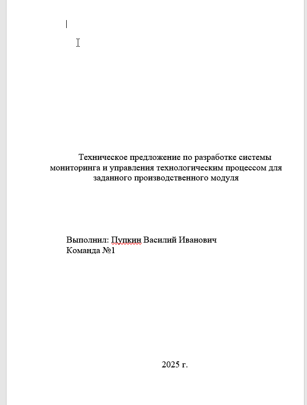
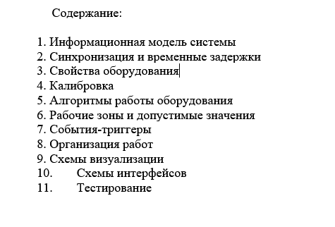
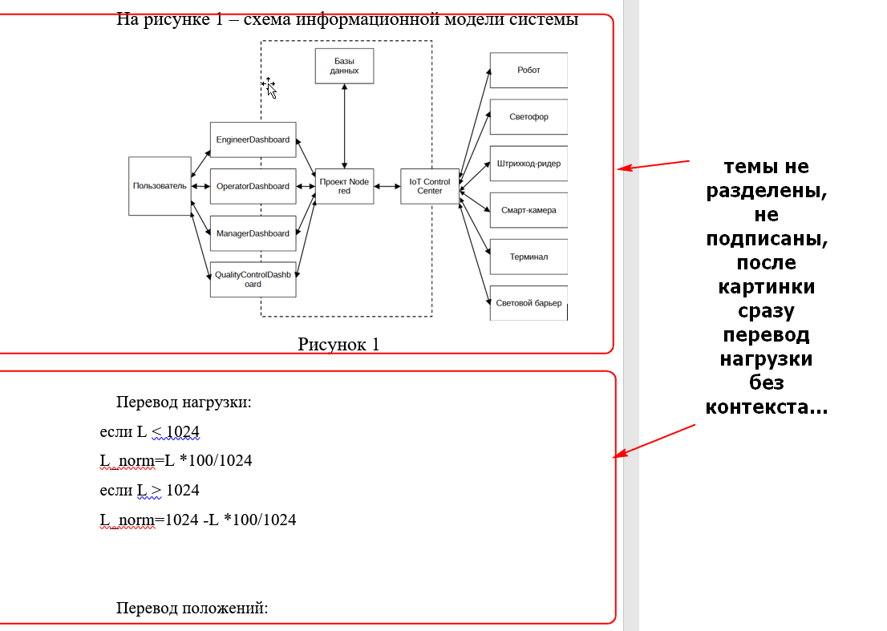
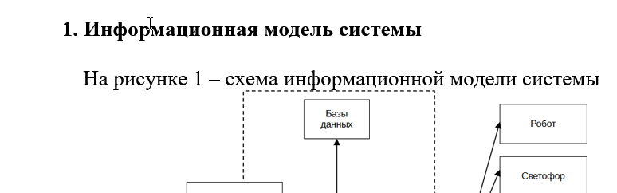
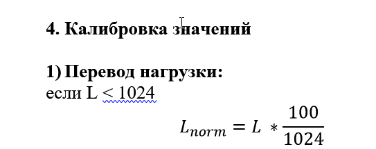

# 0. Оформление и общая информация

В модуле А вам нужно подготовить документ - техническое задание на разработку программного обеспечения. Этот документ вы должны сделать в **word** или **powerpoint**, **назвать файл так, как указано в задании и сохранить в формате .pdf** (это очень важно!!).
Схемы для проекта можно делать в draw.io, напрямую из блоков в word/powerpoint или в Microsoft Visio
Так как вы создаете настоящую документацию, у нее должно быть:
- Титульный лист
- Содержание
- Заголовки и нумерация разделов
- Нумерация страниц

## Титульный лист
На титульном листе нужно указать название документа:
`Техническое предложение по разработке системы мониторинга и управления технологическим процессом для заданного производственного модуля`
(формулировку можно взять из текста задания на модуль А)
И автора документа (ваше ФИО и номер рабочего места), а так же внизу подписать год. Пример титульного листа в ворде:

## Содержание (оглавление)
Второй важнейший элемент оформления - это содержание. Оно должно идти следующим листом после титульного. В содержании вы должны перечислить все, что содержится далее у вас в проекте (заголовки) с нумерацией. Пример самого простого содержания:

Если есть время, в конце строк можно указать номера страниц, на которых расположены все разделы (как в учебнике)

## Заголовки и нумерция разделов
Структура вашей работы определена - вам не нужно придумывать проект,у вас есть четкий список того, что должно быть в проекте (см картинку выше). Текст проекта не должен быть сплошным. Нужно делить текст на разделы, у разделов делать заголовки (с номерами) и выделять заголовки размером или жирным шрифтом
**Так плохо:**

**Так хорошо:**

## Номера страниц
В конце всех страниц (внизу по центру) должны находиться номера страниц. Это делается в word и powerpoint автоматически через меню вставка-> номера страниц-> выбираете нужный тип номеров страниц. Но на титульном листе номера страницы быть не должно, чтобы его убрать, нужно поставить галочку "особый колонтитул для первой страницы"