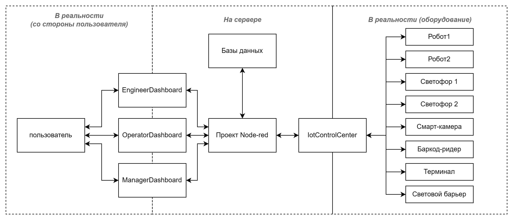
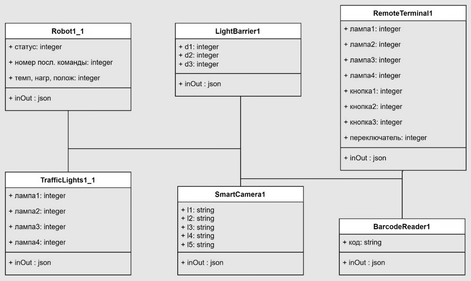
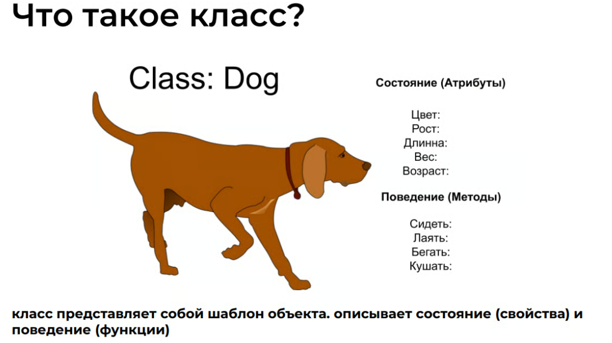
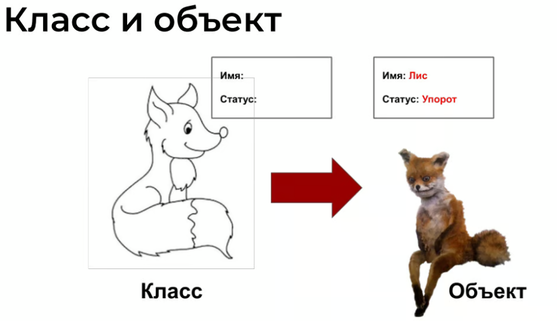
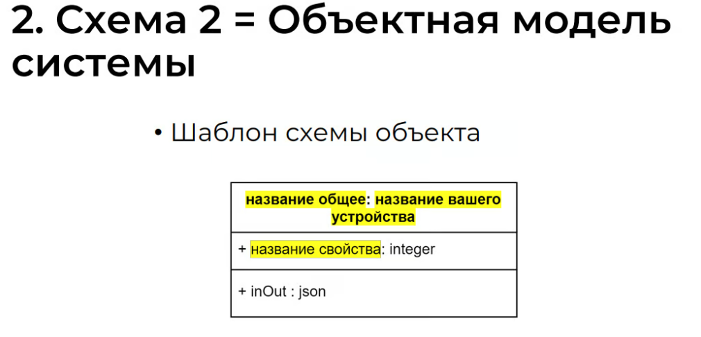
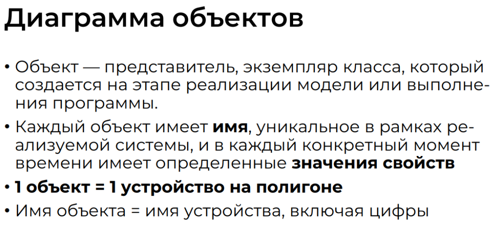
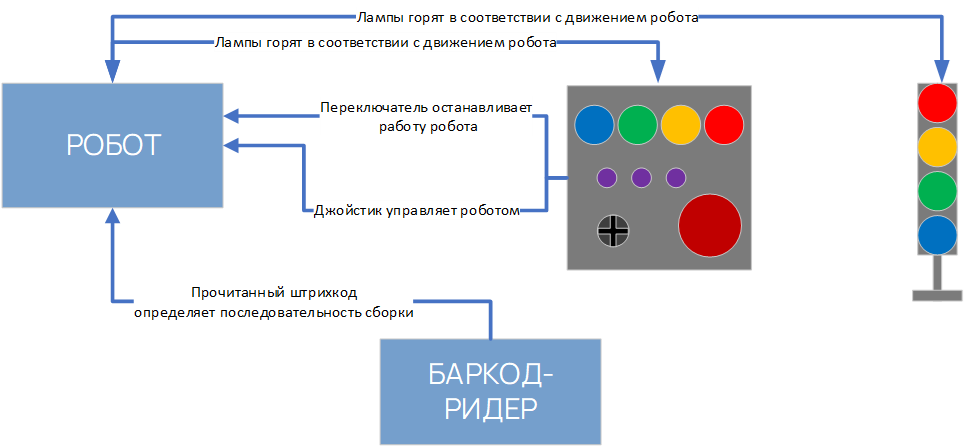

# 1. Информационная модель системы

В это пункте вам надо вставить 3 схемы. Ваша задача – просто запомнить и перерисовать схемы, которые будут далее
## Схема 1. Информационная модель системы

На этой схеме мы должны перечислить все объекты, устройства, сущности в нашем проекте, а это:
- Три дашборда
- Нод ред
- Базы данных (даже если вы их не делаете, в проекте они предполагаются)
- Контрол центр
- Все оборудование (8 штук)
- Пользователь (ведь именно пользователь заходит на дашборды и управляет оборудованием)
На схеме все сущности разделены на 3 группы - то, что находится в реальности - начиная с пользователья (он дает команды и получает данные), далет он это через дашборды. Далее с дашбордов данные приходят в нод ред. Нод ред и базы данных находятся на сервере. далее через контрол центр нод ред общается со всем оборудованием.

## Схема 2. Объектная модель системы

Правила построения (оформления) объектной модели и что это вообще такое, можно прочитать здесь:  https://old.mista.ru/oop_book/glava2_1.htm

Подробнее про объектную модель

Для чемпионата вам достаточно запомнить и перерисовать эту схему
**Обратите внимание, на моем примере-схеме не хватает второго светофора и второго робота! Их нужно добавить самостоятельно!**

## Схема 3. Схема взаимодействия объектов

Эта схема - пример (на ней не все объекты). **Задача этой схемы - показать, как устройства взаимодействуют между собой** (даже если вы это не будете делать в реальности, например, терминал мы не используем для управления роботом, но мы же можем представить что он так используется?)