# 1. Получение данных от оборудования
## Получение данных с помощью IOT Get
Чтобы получить данные от оборудования в NodeRed используется нода Get из пакета IoT ControlCenter. Перетащите ее на рабочую область:
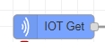

Эта нода получает все данные от всех устройств на полигоне в формате массива объектов JS:
``` js
[{данные устройство1}, {данные устройство2}, {данные устройство3}, ...]
```
Массив со всеми данными приходит 1 раз в секунду.
Часть сообщения (то есть элемент массива), которая относится, например к вещи с именем Robot1_2, выглядит примерно так:
``` js
{
    name: "Robot1_2"
    t1: 38,
    t2: 57,
    m1: 2001,
    m2: 1896,
    l1: 500,
    l2: 674,
    n: 2,
    s: 0,
    ...
}
```
где каждый ключ соответствует какому-то свойству устройства, например, температура мотора 1 - это t1, статус - это s, и так далее. **Свойство name помогает нам отличить одну вещь от другой.**
Все значения свойств являются **числовыми** (number), кроме свойства **name** - это строка (string).

## Получение данных от 1 конкретного устройства
Для удобной работы нам нужно все данные разделить – данные от робота 1 отдельно, данные от терминала отдельно и так далее.
Для этого нам придется написать 2 функции.
- Первая функция будет **забирать из общего потока** сообщений **только сообщения от какой-то одной вещи**, например, робота-паллетайзера. В каждом сообщении указано **название** вещи, к которой оно относится. По этому имени мы можем получить нужное нам сообщение.
Перетащите ноду function из палитры на рабочую область и соедините с нодой Iot get:
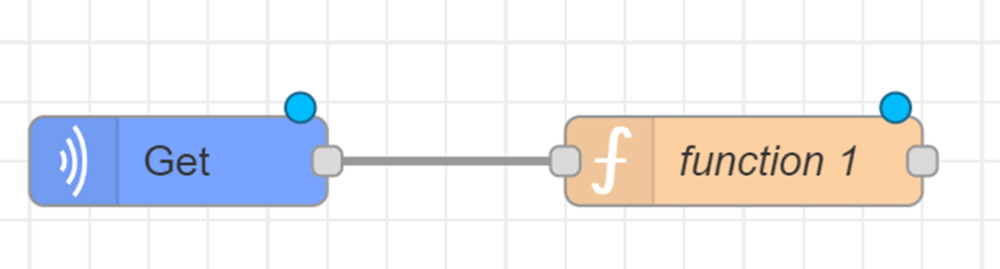

Кликните дважды на function, чтобы открыть ее. В верхней части окна введите название функции: `«Прием от RobotX_1»`.
Код функции должен быть следующим: **если имя устройства равно нужному, передать сообщение дальше** (то есть весь объект со свойствами, относящимися к данному устройству).
Код будет таким:
``` js
if (msg.payload.name == "Robot1_1") { // если имя = robot1_1
    return msg;                       // передать сообщение дальше
}
```
Функция готова.
От робота приходят значения ~20 свойств, каждое имеет свой ключ (t1 = температура 1-го мотора, m2 - положение второго мотора и т.д.)
Удобнее всего получать все эти свойства каждое отдельно или по группам:
- Все температуры - отдельно,
- все положения - отдельно,
- все нагрузки - отдельно
- и все остальное по одному значению - отдельно
Создадим еще одну функцию для получения **только температур моторов**, то есть свойств с ключами t1, t2, t3, t4, (t5, t6). Функцию можно назвать: `«Получение температуры RobotX_1»`
В коде новой функции делаем следующее: создаем переменную, называем ее, например msg1. Эта переменная - объект JS, у которого будет одно свойство – содержание (payload), и это содержание равно тому, что находилось в пришедшем из предыдущей ноды сообщении в свойстве t1
```js
var msg1 = { payload: msg.payload.t1 };
```
Аналогично допишите для свойств t2, t3, t4, t5, t6.

В конце функции нужно написать `return`, чтобы передавать сообщения дальше. Нам нужно передавать msg1, msg2 ... msg6, то есть удобнее всего будет сделать это массивом:
```js
return [msg1, msg2, msg3, msg4, msg5, msg6]
```


<details>
<summary>Функция "Получение температуры RobotX_1" wtkbrjv</summary>

```js
var msg1 = { payload: msg.payload.t1 };
var msg2 = { payload: msg.payload.t2 };
var msg3 = { payload: msg.payload.t3 };
var msg4 = { payload: msg.payload.t4 };
var msg5 = { payload: msg.payload.t5 };
var msg6 = { payload: msg.payload.t6 };
return [msg1, msg2, msg3, msg4, msg5, msg6]
```
</details>

Функция готова, но нужно выполнить еще одну настройку. Так как на выходе у нас массив из нескольких значений, нужно указать это во вкладке Setup:
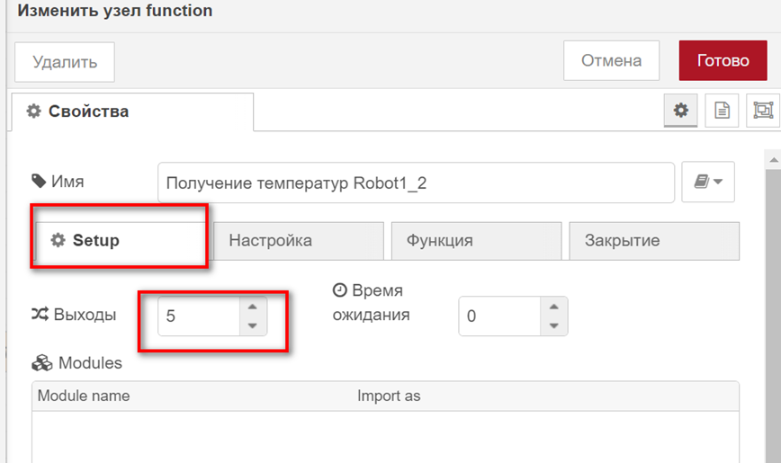

Во вкладке Setup устанавливаем количество выходов = 6 (На скриншотах может быть число 5, но вы делаете столько, сколько у вашего робота моторов! То есть у робота 1 = 6, у робота 2 = 4)
Готово.

Текущий вид цепочки блоков:
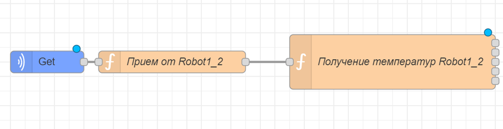

Остается вывести значения на экран, так как **результатом выполнения задания считается только то, что выводится на дашборд**.

## Вывод на экран с помощью виджета text и настройка дашборда
**В данном туториале используется пакет Dashboard2**, но так же можно использовать Dashboard с незначительными отличиями в настройке виджетов.
Выводить значения всех числовых свойств удобнее всего с помощью виджета text (вытащите его на рабочее поле):
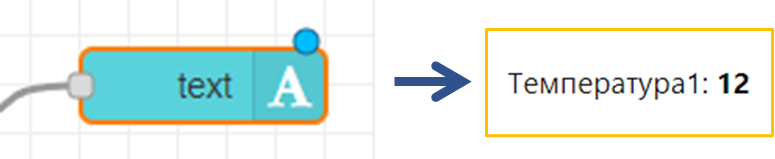

В общем виде схема всего дашборда инженера-технолога будет примерно такой:
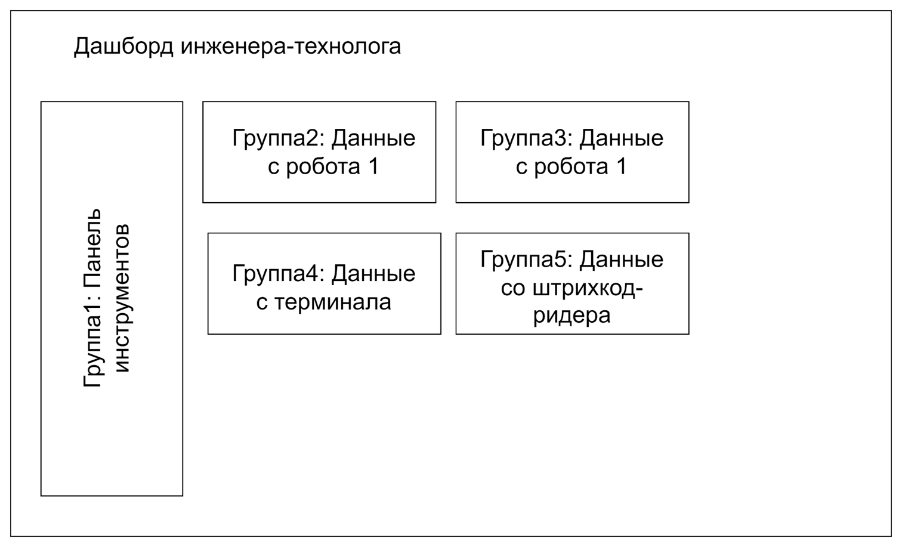

То есть мы будем объединять виджеты в группы по принципу отношения к тому или иному устройству, или функционалу.

Кликните дважды по виджету text. Сначала (при добавлении первого дашборд-виджета) нужно настроить сам дашборд и группы. В окне настройки виджета text кликните выпадающий список, выберите там "Добавить новый ui-group", а затем на значок с ручкой в поле Group.
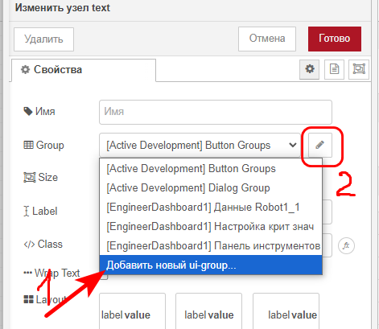
У вас откроется новое окно - настройка группы. В ней нужно указать, на какой вкладке (дашборде), будет находиться эта группа. Дашборд еще не создан, поэтому нажмите на выпадающий список "Group", выберите "Добавить новый ui-page", затем нажите на иконку с ручкой
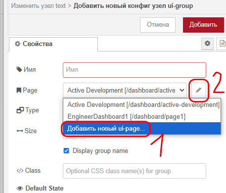

В появившемся окне можно настроить новую страницу. Введите ее название (согласно заданию, это EngineerDashboardX.
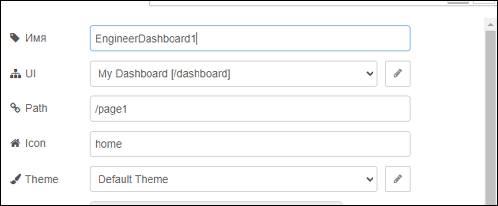
Больше менять ничего не нужно, поэтому нажмите на красную кнопку "готово" в верхней части окна редактирования. Вы вернетесь ко вкладке редактирования **группы**. Так как в этой группе будут находится виджеты для отображения данных робота 1, назовите группу "Данные RobotX_1". Убедитесь, что в разделе Page выбран дашборд EngineerDashboard.
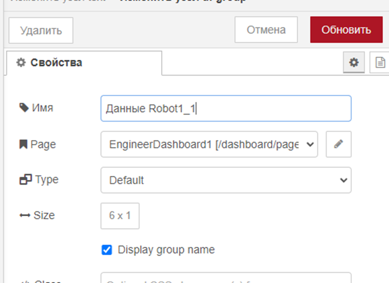
Если все готово, нажмите красную кнопку "готово" или "обновить" в верхней части окна редактирования.
Вы вернетесь к редактированию виджета text, с которого все началось. Проверьте, что в поле group верно выбран дашборд и группа, в поле label введите название текстового поля, в поле layout выберите стиль отображения:
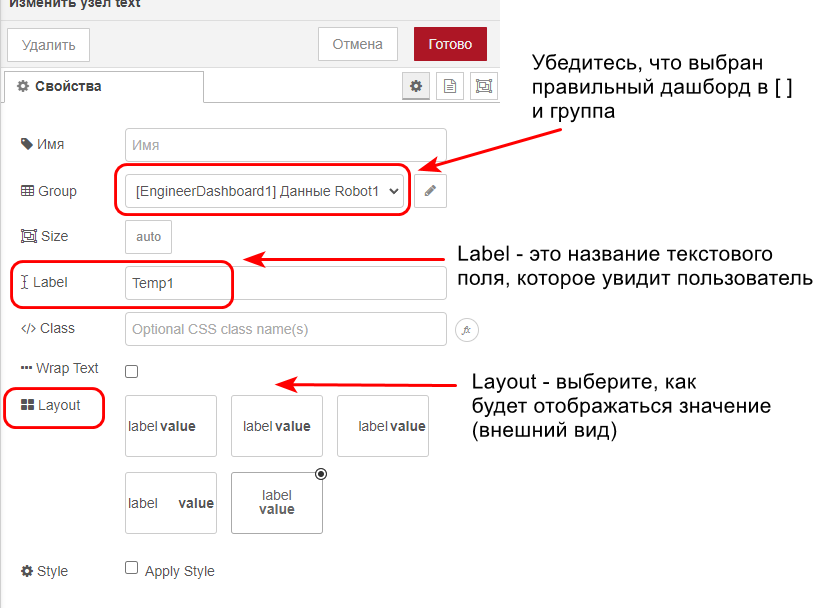
Когда все готово, нажмите кнопку "готово".
Внешний вид цепочки блоков в node red:
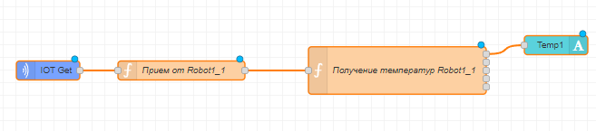
Теперь вы можете скопировать настроенный виджет text и сделать то же самое для температур 2...5:
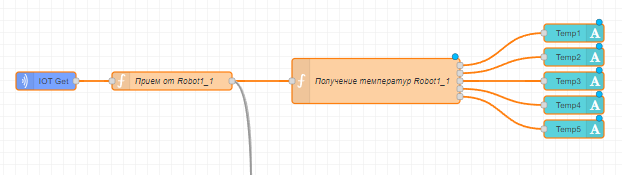

## Задания для самостоятельной работы:
Добавьте функции и виджеты для вывода на экран нагрузок 1...6 и положений 1...6, а так же свойств s (статус), l (номер последней команды), c (счетчик команд), i (info) для робота