# 10. Сохранение логов в БД

По заданию на дашборде инженера-технолога нужно собирать и сохранять в базу данных логи, которые содержат информацию о предупреждениях и событиях, происходящих на полигоне. Достаточно будет этих событий:

- Достижение критических значений моторов (нагрузка, положение, температура) 1го робота (в идеале и 1 и 2го робота)
- Нарушение периметра безопасности

Зачем это нужно в реальности? Дашборд показывает нам все, что происходит в реальном времени. Но ведь часто может быть ситуация, когда пользователю нужно посмотреть предыдущие данные, ошибки и т.д., которые произошли какое-то время назад. Например, случилась авария, и мы хотим посмотреть логи чтобы увидеть, что предшествовало этой аварии. Или мы хотим посмотреть как часто перегреваются и какие моторы, чтобы знать, когда нужно их заменить... и так далее.

Сначала разберемся, что такое базы данных и как с ними работать.

## Базы данных - общая информация

База Данных (БД или database) - совокупность структурированных данных

SQL - язык запросов Базы данных

MySQL - это Система Управления Базами Данных (СУБД). Есть много разных, но в нашем случае удобнее использовать эту.

Базы данных состоит из **файлов** и **таблиц**, таблицы состоят из **записей (строк)**

Для работы с БД будем использовать программу MySqlWorkbench. Откройте и зайдите в нее (логин и пароль у преподавателя)

Таблицы, как правило, содержат в себе тематическую информацию, например:

- Таблица `users` с данными пользователей
- Таблица `climat` с данными с датчиков температуры и влажности в квартире
- Таблица `news` с данными новостей на сайте

Таблицы состоят из записей (строк) и **полей (столбцов)**. В таблице users могут быть такие поля:

- `id` (номер записи)
- `логин`
- `пароль`
- `email`

**Запись** – строка в таблице, где каждая отдельная ячейка содержит значение соответствующее определённому полю. Пример таблицы users:

| id | логин    | пароль     | email               |
| -- | -------- | ---------- | ------------------- |
| 1  | Naruto99 | 1234554321 | vasya@mail.ru       |
| 2  | IvanovPS | 1990qwerty | petr.Ivanov@mail.ru |
|    |          |            |                     |

В одной базе данных может быть много таблиц. Например, у нас есть БД нашего сайта интернет-магазина, а в ней есть таблица с данными пользователей и таблица с данными карточек товара и таблица с данными продавцов.

Итак, структура БД в нашем проекте будет такая:

1 база данных на все, название например iot -> в ней несколько таблиц, например, таблица для логов инженера технолога (engineer\_logs), таблица для логов оператора (operator\_logs) и какие-нибудь другие таблицы

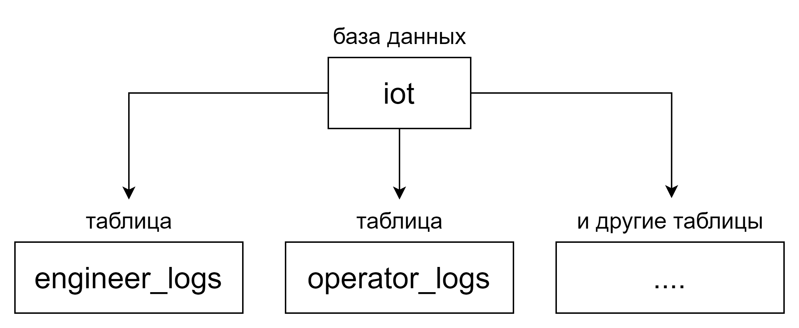

Внутри MySQL Workbench это выглядит так:

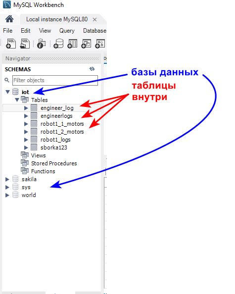

Работа с базами данных осуществляется на языке SQL. Мы отправляем в БД SQL запрос, а система управления базы данных его обрабатывает и выдает какой-то результат. Например, можно отправить такие запросы:

- вывести последние 10 записей таблицы
- вывести все записи в которых написано слово roblox
- вывести все значения из столбца "температура" выше 50\*
- добавить или удалить новую запись в таблицу

и многие другие. Нам придется изучить несколько основных команд, потому что мы будем писать их в node-red чтобы добавлять новые записи в логи

- команда SELECT для вывода (отображения\_) данных

```sql
SELECT поля FROM название_таблицы;
```

отобразить поля из таблицы с указанным названием, например:

```sql
SELECT * FROM my_table;
```

вывести все (это указывается звездочкой \*) поля из таблицы my\_table

- команда INSERT для вставки данных в таблицу

```sql
INSERT INTO название_таблицы(поля таблицы через запятую) VALUES (значения через запятую);
```

например:

```sql
INSERT INTO staff(name, date_of_birth) VALUES ("Jack", "1977-07-29");
```

Результат, если изначально таблица была пустая:


## Создаем БД и таблицу для логов инженера-технолога

Зайдите в MySQL Workbench, создайте БД (назовите как удобно и запомните название). Затем нажмите на создание таблицы:

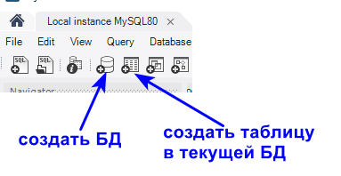

Откроется окно с настройками новой таблицы:

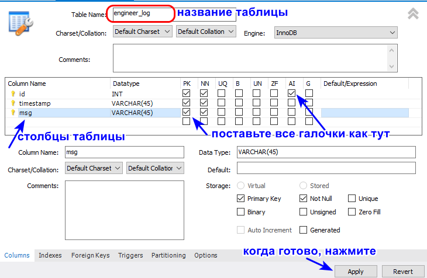

В таблице логов инженера будет три столбца:

- id - номер записи. ставим галочку AI (auto increment), чтобы номер присваивался автоматический 1, 2, 3 и тд
- timestamp - метка времени - тут будет записано, в какое время появилась эта запись
- msg (message) - это само сообщение логов, например "ВНИМАНИЕ КРИТИЧЕСКАЯ ТЕМПЕРАТУРА temp2!" или "нарушен периметр безопасности"

После нажатия apply в появившихся окнах со всем согласитесь. После этого таблица будет создана. Чтобы посмотреть записи в таблице нужно или отправить команду на языке SQL, либо нажать на кнопку рядом с названием таблицы:

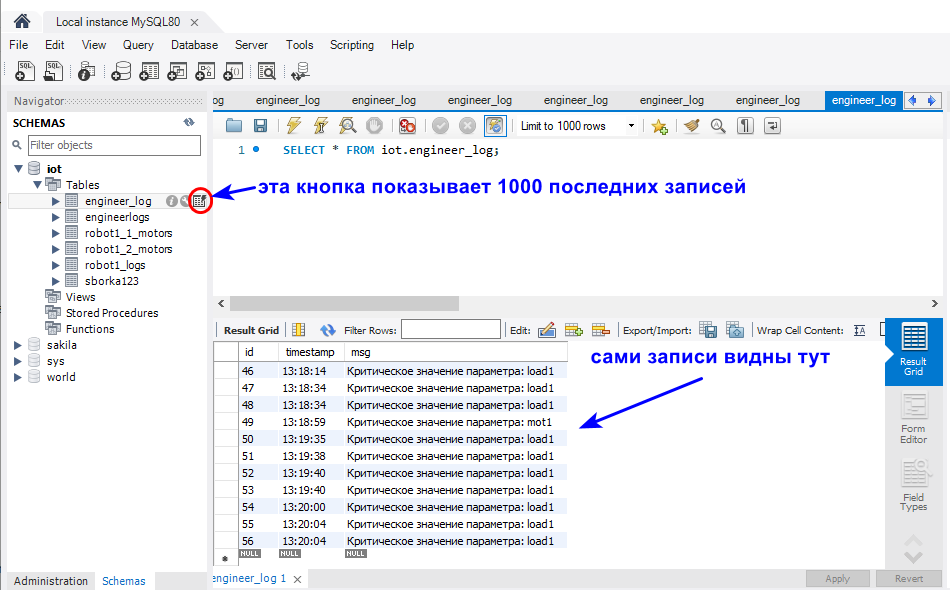

Таблица подготовлена, пока она пустая. Теперь переходим в node-red, чтобы настроить добавление записей в нее.

В node-red удобнее выполнять работу с БД на отдельной вкладке (в отдельном потоке)

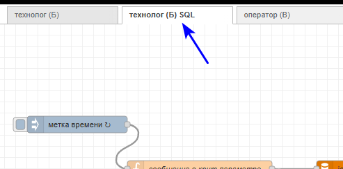

Добавляем ноду mysql:


Настройка ноды:

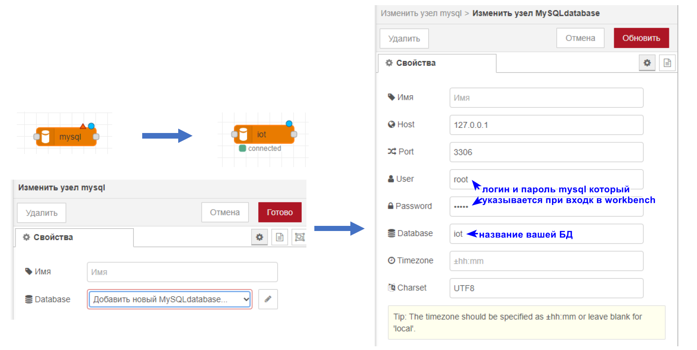

Теперь нужно настроить, а когда именно и какие сообщения будут в эту таблицу БД записываться. Вернемся на вкладку технолога.

## Сообщения о критических значениях роботов в БД

Нас интересуют ноды раскраски температуры, положений и нагрузок. Попробуем на примере раскраски температуры первого мотора.

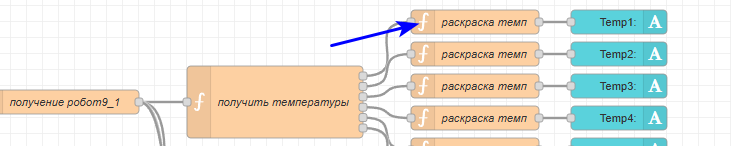

Сейчас у нас там такой код:

```javascript
if (global.get("perevodSwitch")){
    if (msg.payload > global.get("critTempMax") || msg.payload < global.get("critTempMin")) {

        msg.ui_update = { color: "red" };

    } else if (msg.payload > global.get("dopTempMax") || msg.payload < global.get("dopTempMin")) {
        msg.ui_update = { color: "orange" };
    } else {

        msg.ui_update = { color: "green" };

    }
} else {
    msg.ui_update = { color: "black" };
}

return msg;
```

Сообщения будем отправлять только при критических значениях. Создадим глобальную переменную critParam, в которую будем записывать название параметра, который достиг критического значения в данный момент, например "temp1", "load5" и т.д. Соответственно, добавляем в данном коде такую строчку в if с критическими значениями:

```javascript
if (global.get("perevodSwitch")){
    if (msg.payload > global.get("critTempMax") || msg.payload < global.get("critTempMin")) {

        msg.ui_update = { color: "red" };
        
        global.set("critParam", "temp1") // НОВАЯ СТРОЧКА

    } else if (msg.payload > global.get("dopTempMax") || msg.payload < global.get("dopTempMin")) {
        msg.ui_update = { color: "orange" };
    } else {

        msg.ui_update = { color: "green" };

    }
} else {
    msg.ui_update = { color: "black" };
}

return msg;
```

Ок, теперь, когда температура 1 станет критической, в глобальную переменную critParam запишется "temp1".

Теперь нужно сформировать запись в базу данных. Возвращаемся на вкладку с базой данных и добавляем новую функцию, соединяем ее с оранжевой нодой базы данных:

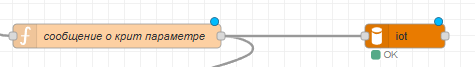

Внутри этой функции будет происходить следубщее: если глобальная  переменная critParam не нулевая (то есть != 0), то формируем сообщение вида "Критическое значение параметра: " + название параметра, по которому крит значение (а это название параметра у нас и хранится в переменной critParam).

Итого в начале кода:

```javascript
if (global.get('critParam') != 0){
    var message = 'Критическое значение параметра: ' + global.get('critParam')
    return msg; //обратите внимание что return внутри if'a
}
```

Получим, например, 

```javascript
Критическое значение параметра: temp1
```

Но теперь этот текст в переменной message нам нужно отправить в БД в нужную таблицу в нужный столбец. Запись в базу данных делается командой SQL "INSERT". Чтобы отправить команду в БД из node-red, нужно отправить ее в текстовом виде в msg.topic. SQL команда целиком будет выглядеть так:

```
'INSERT INTO engineer_log (timestamp, msg) VALUES (CURTIME(), "' + message +'");'
```

Обратите внимание, что кавычки вокруг всей строки одинарные ', а внутри них есть еще двойные кавычки "

Весь код функции тогда:

```javascript
if (global.get('critParam') != 0){
    var message = 'Критическое значение параметра: ' + global.get('critParam')
    msg.topic = 'INSERT INTO engineer_log (timestamp, msg) VALUES (CURTIME(), "' + message +'");'
    return msg;
}
```

Когда эта функция будет вызываться? Вешаем ее на автообновление:

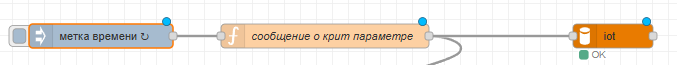

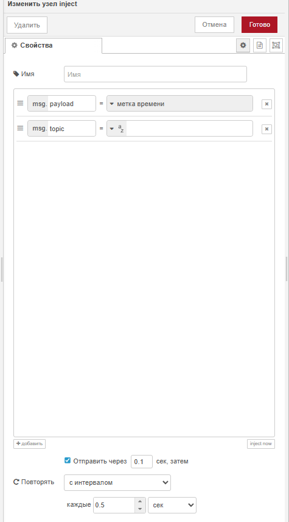

ТО есть каждые 0.5 секунды функция будет проверять, не равна ли переменная critParam нулю, и если не равна, то будет отправлять запись в базу данных.

Есть еще один нюанс: дело в том, что значение переменной critParam у нас записывается (в функции раскраски), но никогда не сбрасывается. То есть если хотя бы раз значение внутри critParam появилось, то оно оттуда никуда не пропадет и будет все время деклаться записи в БД. Чтобы такого не происходило, нужно добавить сброс этой переменной (чтобы она стала равна 0) через какое-то время. Добавим ноду delay на 0.5 сек после функции "сообщение о крит параметре":

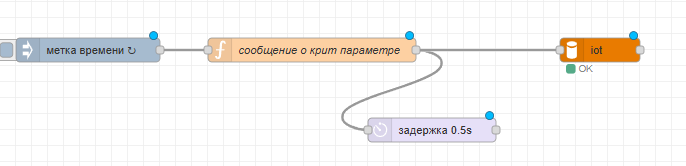

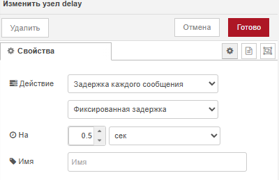

И после задержки делаем функцию "сброс critParam":

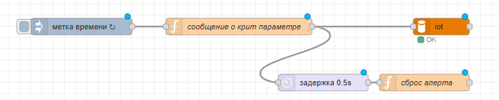

С таким кодом:

```javascript
global.set('critParam', 0)
return msg;
```

То есть через 0.5 сек после того, как в переменной critParam появилось значение и сделалась запись в БД, значение critParam снова изменится на 0.

Наконец, если вы посмотрите внимательно на то, как делаются записи в БД, увидите, что при одном и том же критическом значении делается не одна запись в БД, а несколько. Это происходит из-за того, что значения от робота приходят не мгновенно, а раз в какой-то период времени (по факту при использовании рандомных данных примерно раз в 0.3 сек, при работе с реальным роботом раз в 1 сек). Чтобы исправить это, нужно добавить пару задержек (ограничений скорости). Добавляем задержку 1 сообщение в 1 секунду перед записью в БД:

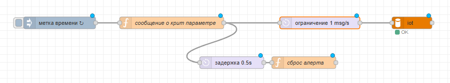

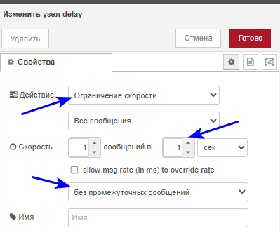
