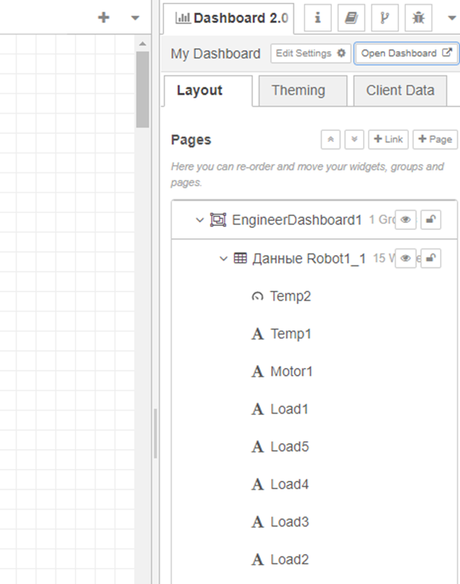
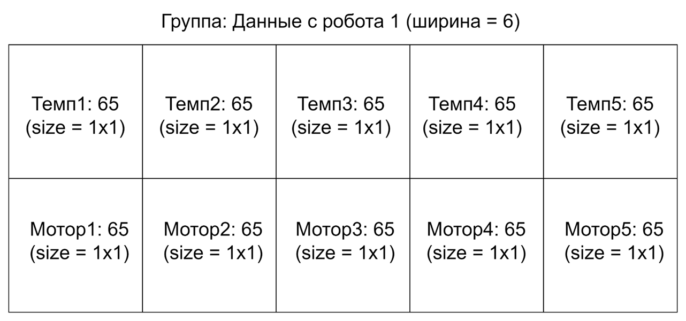
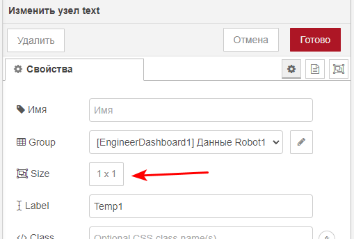
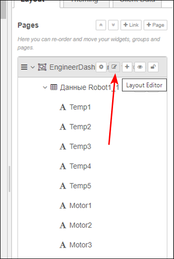
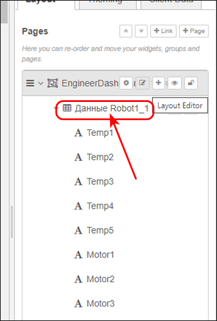
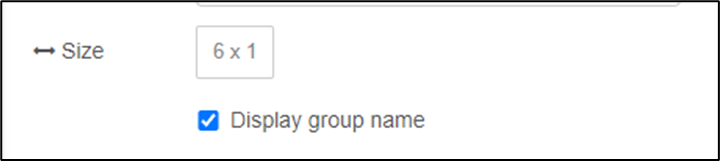
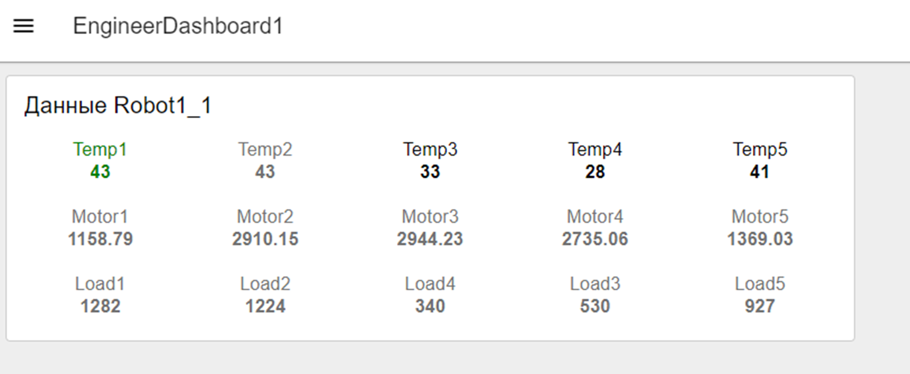

# Настройка внешнего вида и положения виджетов

Сейчас все виджеты находятся друг под другом, одно значение занимает всю строку, все значения не влезают на экран. Наведем красоту.

## Порядок виджетов и групп

**Порядок виджетов** можно поменять во вкладке «Dashboard2».

Для начала расставьте их все по порядку (сначала все температуры, потом все motor, потом все load):

**Любая группа виджетов - это сетка**, у которой мы можем выбрать **ширину** (измеряется в "квадратиках" фиксированного размера), а затем выставить **размер каждого виджета** (в квадратиках)

Положение виджетов выбирается автоматически, они просто идут друг за другом по порядку. Мы можем настроить их порядок и размер, чтобы сделать интерфейс лучше.

### Размер виджетов

Выставьте размер каждого виджета Text = 1x1 (для этого кликните дважды на виджет, в окне настроек в поле size выберите размер):

## Размер групп

Также нужно выставить **размер группы.**

**Способ 1**: в панели Dashboard2 навести мышь на название дашборда (EngineerDashboard), нажать на 2ю иконку (layout editor), в появившемся окне изменить размер групп мышкой *(способ предпочтительнее, если уже много виджетов и групп):*

**Способ 2**, в той же панели навести мышь на название группы, нажать на иконку с шестеренкой *(способ предпочтительнее, если пока мало виджетов и групп)*:

В открывшемся окне выставить нужную ширину группы:

Результат для группы виджетов "Данные робот1_1":

