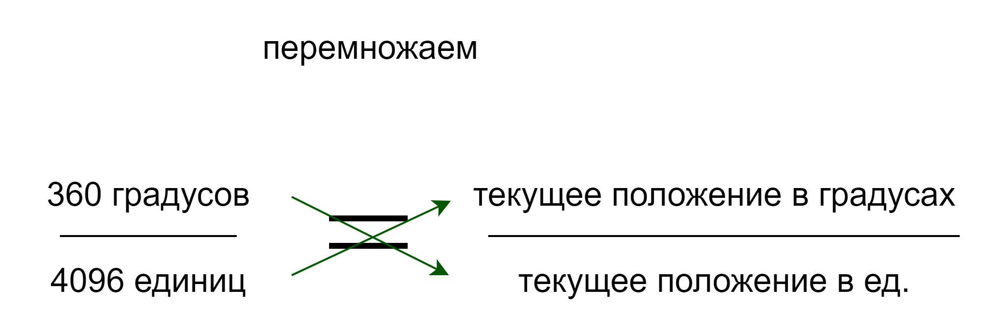
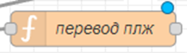
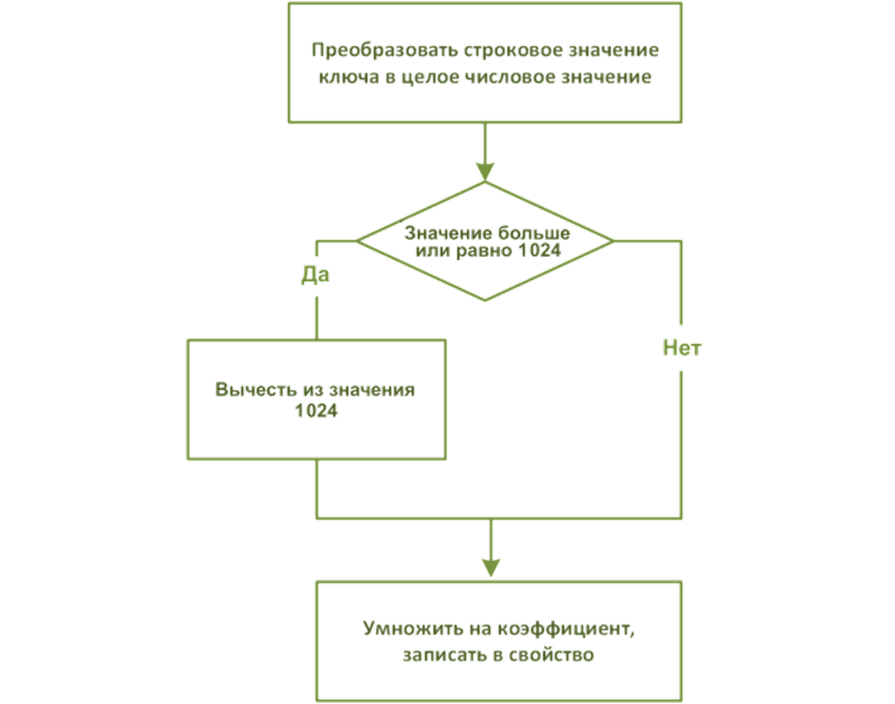
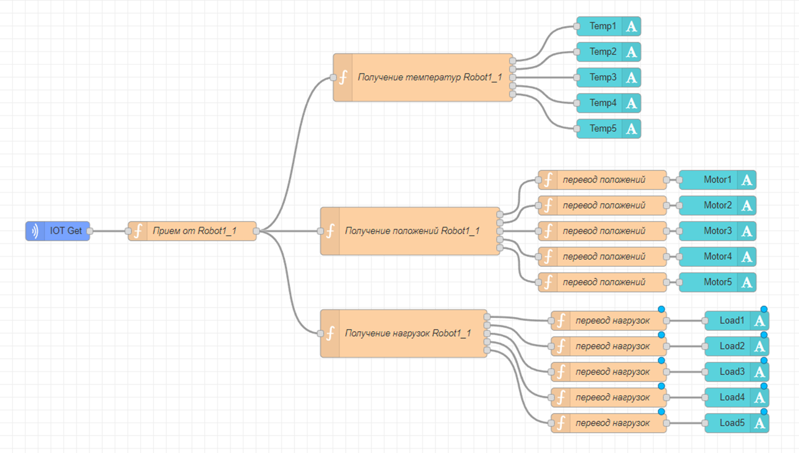

# Перевод значений

Ряд па­рамет­ров, пос­ту­па­ющих от ро­бота, тре­бу­ет **пре­об­ра­зова­ния в ре­альные фи­зичес­кие ве­личи­ны** и ка­либ­ровки (пе­рес­че­та со сдви­гом ну­ля и мас­шта­биро­вани­ем); прин­ци­пы пре­об­ра­зова­ния и пе­рес­че­та указываются в задании в документе "описание оборудования".

Обычно нужно перевести:

-  Motor1…6 из импульсов в градусы
-  Load1…6 из импульсов в проценты (100% = макс нагрузка)

То есть, показания от датчиков положения и нагрузки приходят от робота в систему в некоторых единицах измерения, которые не понятны пользователю (положение мотора 2 = 2097 - это что за положение? где находится мотор?). Но нам известны максимальные и минимальные значения, соответственно, мы можем перевести из единиц измерения датчиков в нормальные и понятные единицы.

## Преобразование положений

Раз­ре­шение датчиков положения сер­во­мото­ров сос­тавля­ет 4096 им­пульсов/обо­рот. То есть, мотор может находиться в любом положении от 0 до 4096 ед.

На самом деле разрешение датчиков положения зависит от типа мотора. Для моторов 1,2,3,4 - от 0 до 4096, для моторов 5, 6 - от 0 до 1024. Учитывайте это при расчетах для 5, 6 моторов

При этом, нормально положение моторов можно измерить в градусах, где 0\* - это начальное положение (не повернут), а 360\* - это полный оборот.

Решаем уравнение пропорции (справка по математике за 6 класс [тут](https://skysmart.ru/articles/mathematic/zadachi-na-proporcii)):





Получившаяся формула - универсальная, подходит не только для положения моторов, но и для нагрузок и т.д. То есть `переведенное значение = старое значение * (макс значение в нормальных единицах)/(макс значение в старых единицах)`

Назовем текущее положение в единицах oldMotor (то есть "старое значение положения"), а искомое текущее положение в градусах - newMotor. То есть код формулы будет таким:

`newMotor = oldMotor * (360/4096)`

Создадим функцию "перевод положений":



Само значение вычислим по формуле `newMotor = oldMotor * (360/4096)`. Но из-за дроби это значение так же будет дробным с \~9 знаками после запятой, поэтому его нужно округлить (иначе просто не влезет на экран). Для этого используем `Math.round()`.

Кроме того, мы должны передавать дальше (на виджет text) не просто число, а **объект** сообщения, в котором **payload** будет равен **значению** положения. Таким образом, код функции:

```javascript
var oldMotor = msg.payload; // значение положения приходит в эту функцию 
                            // из предыдущей в виде msg.payload

var newMotor = { payload: Math.round(msg.payload*(360/4096)) };

return newMotor;
```

## Преобразование нагрузок

Для нагрузки тоже требуется перевод, но он немного сложнее, потому что нагрузка может действовать на мотор в двух разных направлениях.

От робота (независимо от мотора) приходит значение от 0 до 2048

-  Если значение с робота = 0...1023 - то нагрузка давит **направо** и измеряется 0...100%
-  Если значение с робота = 1024...2048 - то нагрузка давит **налево** и измеряется 0...100%

Нам не важно само направление, но нужно учитывать это при расчете.

Алгоритм будет следующим:



Итак, если полученное значение >= 1024, то из этого значения нам надо вычесть 1024 и записать в туже переменную:

```javascript
var oldLoad = msg.payload;   // значение нагрузки приходит в эту функцию из предыдущей в виде msg.payload 
var newLoad = 0;             // изначально новое значение = 0 
if (oldLoad >= 1024){        // если пришедшее значение >=1024
  oldLoad = oldLoad - 1024;  // то вычесть из него 1024
}
```

Наконец, старое значение нужно умножить на 100/1024 (и округлить и записать все как объект).

Итого весь код функции "перевод положений":

```javascript
var oldLoad = msg.payload;   // значение нагрузки приходит в эту функцию из предыдущей в виде msg.payload 

if (oldLoad >= 1024){        // если пришедшее значение >=1024
  oldLoad = oldLoad - 1024;  // то вычесть из него 1024
}
var newLoad = { payload: Math.round(oldLoad * 100/1024) };
```

Самостоятельно скопируйте функцию на все выходы нагрузок:

