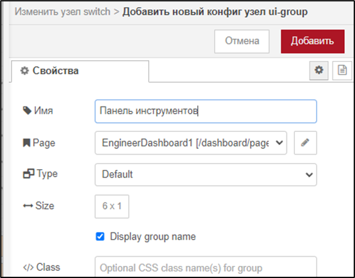
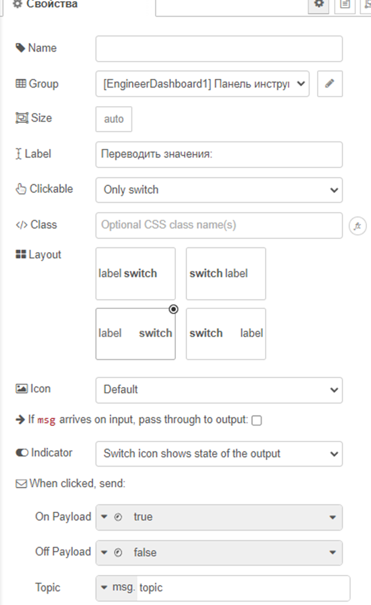
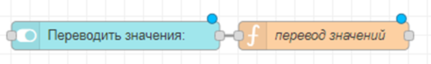
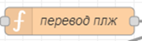
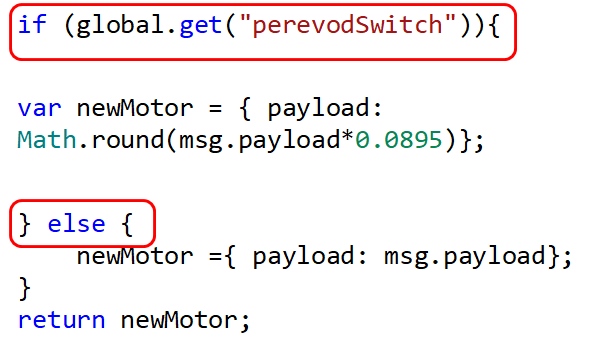
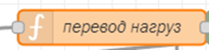
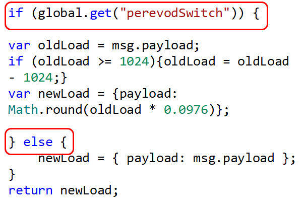

# Переключатель перевода значений


По заданию, мы должны сделать переключатель, который будет включать\\отключать перевод значений. Это позволит сэкономить место – выводить только либо переведенные значения, либо сырые.

Этот переключатель может быть 1 на оба робота, либо свой на каждого. В основном делаем 1 на все

Для этого добавим ноду Switch (пакет Dashboard2) и функцию:


Логика должна быть следующей: создадим внутри функции ГЛОБАЛЬНУЮ переменную, в которую будем записывать значение переключателя (true если включен и false если выключен), и дальше будем использовать ее в других функциях.

Виджет Switch нужно добавить в новую группу: «Панель инструментов». В ней будем добавлять все переключатели и настройки



У самого виджета измените только группу и название:



**Общая информация о глобальных переменных:**

Чтобы создать глобальную переменную, которая будет действовать в рамках **одного потока**, используем команду

`flow.set(«имя переменной», значение)`

Чтобы создать **глобальную переменную на все потоки**, используем

`global.set(«имя переменной», значение)`

Для получение значения используем:

`flow.get(«имя переменной»)` или

`global.get(«имя переменной»)`

**В данном проекте всегда используем global.**

Создадим глобальную переменную perevodSwitch, в нее нужно записать значение состояния переключателя (а оно приходит в функцию от блока переключателя в msg.payload).

Код функции для переключателя:

```javascript
global.set("perevodSwitch", msg.payload);
return msg;
```



Теперь эту переменную можно вставить в функции «перевод положений», «перевод нагрузок»:

**для положений** (ваш код может немного отличаться от того, что на скриншоте, но if добавляется точно так же):





для нагрузок:



