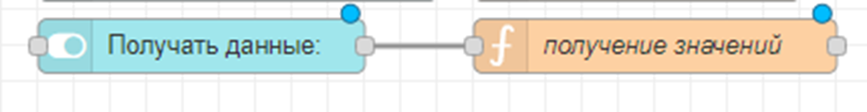
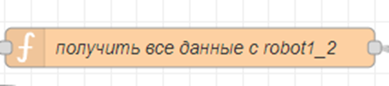
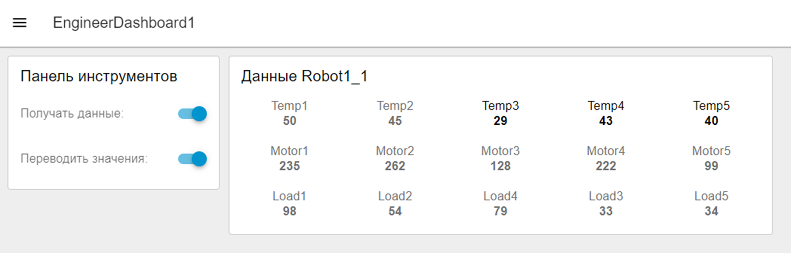

# Переключатель приема данных

По заданию также нужно реализовать **переключатель**, который будет **включать/выключать прием данных** вообще.

Сделаем это аналогично переключателю перевода значений



Код функции:

```javascript
global.set("poluchatSwitch", msg.payload);
return msg;
```

За получение данных у нас отвечает функция "получить все данные \<название устройства>", например:


Изменим код этой функции.

Было так:

```javascript
if (msg.payload.name == "Robot1_2"){
    return msg
}
```

Станет так:

```javascript
if (msg.payload.name == "Robot1_2" && global.get("poluchatSwitch")){
    return msg
}
```

То есть, передавать данные (от робота 1_1), только если название = robot1_1 **И** переключатель приема данных включен

Внешний вид с двумя переключателями (прием данных из этого раздела и перевод значений из п. 4):



не забудьте изменить размер виджетов и группы