# Критические и допустимые значения

У пользователя также должна быть возможность задать на веб-интерфейсе **критические** и **допустимые** значения для свойств роботов (температуры, нагрузки, положения)

-  Если свойство вышло за границы допустимых знач. -> предупредить
-  Если свойство вышло за пределы критических знач. -> предупредить ГРОМКО и все выключить
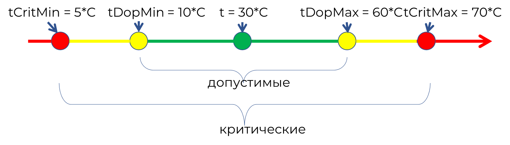

В данном примере будут рассмотрены только критические значения, для допустимых все делается аналогично

## Форма для ввода критических значений

Для начала, на дашборде нужны виджеты, которые позволят **вводить критические значения**. Используем виджет **form** и сделаем в нем 6 полей для ввода максимального и минимального критических значений температуры, нагрузки и положения

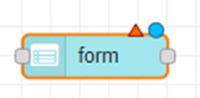

Форма будет сама передавать все значения в следующий блок в формате:

```javascript
msg = { payload:
                critLoadMax: значение,
                critLoadMin: значение,
                critTempMax: значение,
                critTempMin: значение,
                critMotorMax: значение,
                critMotorMin: значение,
}
```

Для виджета form создадим отдельную группу «Настройка крит знач»:

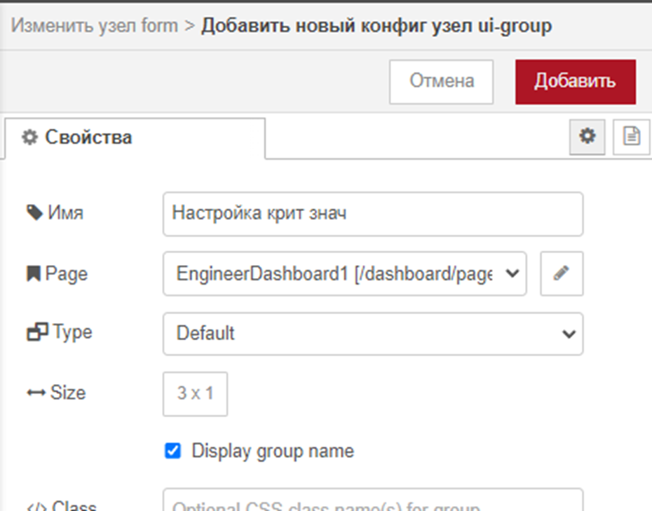

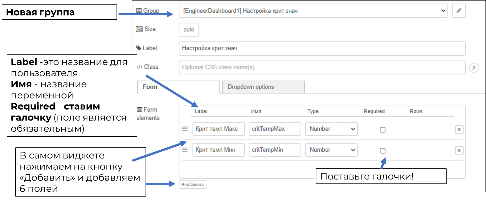

Дальше добавим функцию function «Запись критических значений». Внутри этой функции должен быть простой код: пришедшие из формы значения записать в глобальные переменные:

-  critLoadMax,
-  critLoadMin,
-  critTempMax,
-  critTempMin,
-  critMotorMax,
-  critMotorMin

Создайте функцию и присоедините ее к виджету form. Функция будет получать значения из формы (msg.payload.название\_переменной) и записывать их в соответствующие глобальные переменные

Copy

```javascript
global.set("critTempMax", msg.payload.critTempMax);
global.set("critTempMin", msg.payload.critTempMin);
//… и т.д. для остальных
```

Допишите самостоятельно для остальных значений.

## Критические значения по умолчанию

<mark style="background-color:orange;">А что, если пользователь не введет никаких значений? Ничего не будет работать?</mark>

Мы можем установить какие-то значения **по умолчанию**, чтобы сразу было видно, что функционал работает.

Логика такая: пусть при запуске дашборда какие-то базовые значения сразу записываются в глобальные переменные.

Чтобы выполнить какое-то действие при запуске страницы автоматически 1 раз, используем ноду inject:

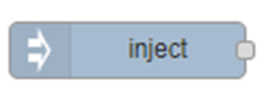

Настройки не меняйте, только поставьте галочку:

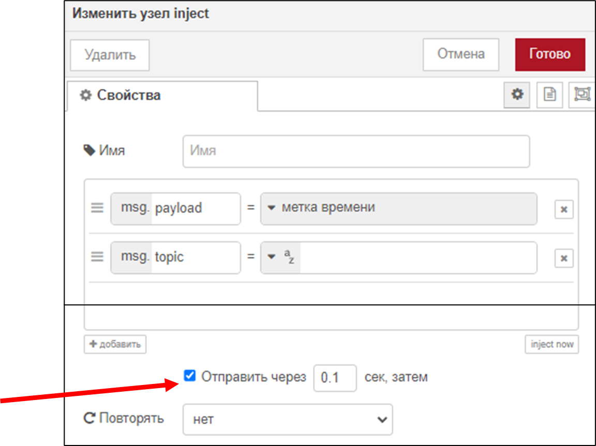

Теперь эта нода будет 1 раз при запуске страницы выполнять функцию, которую мы к ней присоединим.

Создайте функцию «инициализация глобальных переменных»:

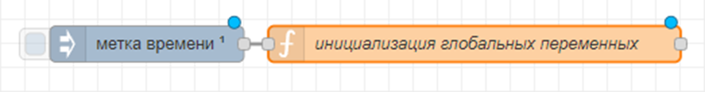

Внутри функции добавьте строки (6 штук), значения можно поставить такие:

-  critLoadMax = 100
-  critLoadMin = 0
-  critTempMax = 70
-  critTempMin = 0
-  critMotorMax = 360
-  critMotorMin = 0

Внутри функции код:

```javascript
global.set("critTempMax", 0);
global.set("critTempMin", 100);
//… и т.д. остальные значения
```

Чтобы проверить в любой момент времени, какие значения у вас записаны в глобальные переменные:

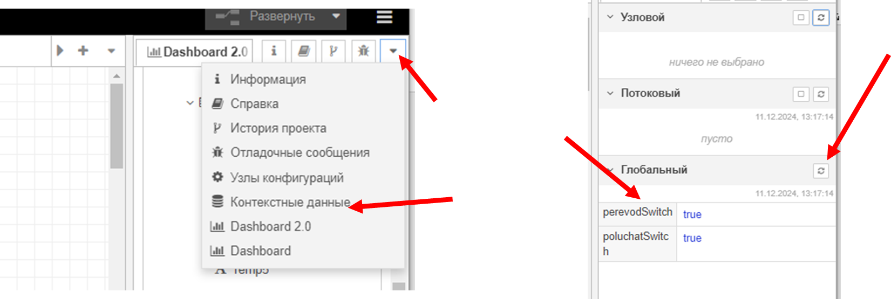

**!!! Прежде чем идти дальше, убедитесь:**

-  Что ваши крит значения по умолчанию записываются сразу после запуска страницы;
-  Что значения из формы также записываются в глобальные переменные.

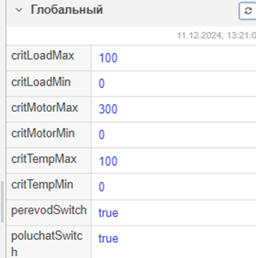

## Раскраска критических значений

**Теперь нужно как-то использовать эти значения**. Будем **раскрашивать** значения свойств роботов, если они выходят за границы критических (больше максимального или меньше минимального) в <mark style="color:red;">**красный**</mark> цвет (потом то же самое для допустимых, но в <mark style="color:orange;">**желтый**</mark> цвет).

Для этого создаем функцию "раскраска температур":

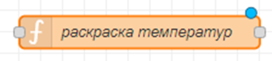

Что делает функция:

-  **Если** msg.payload (входящее в нее значение) **\>** максимального ИЛИ **\<** минимального, то нужно отправить сообщение следующего вида: `msg.ui_update = {color: "red"};`
-  **Иначе** отправить то же самое, но с другим цветом ( то есть температура нормальная): `msg.ui_update = {color: "green"};`

Функция целиком (раскраска температур):

```javascript
if (msg.payload > global.get("critTempMax") || msg.payload < global.get("critTempMin")){
   
    msg.ui_update   = {color:  "red"};
 
} else {
  
  msg.ui_update = {color:  "green"};
   
}
return msg;
```

Эту функцию поставим перед виджетом text для температуры:

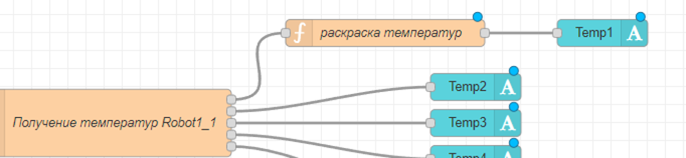

Чтобы все заработало, нужно также **поставить галочку «Apply style» в том текстовом виджете, к которому вы присоединяете функцию раскраски**

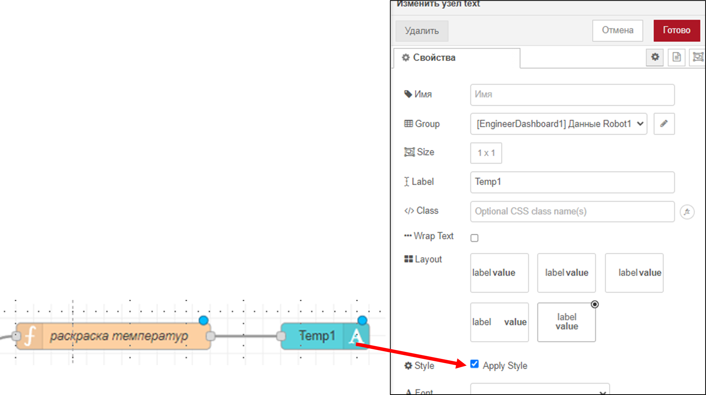

## Задания для самостоятельного выполнения:

1. Добавьте функцию раскраски к остальным температурам, а также напишите функции «раскраска нагрузок» и «раскраска положений»
2. Сделайте все то же самое для допустимых значений (добавьте еще одну форму для допустимых и настройте раскраску в желтый цвет, это можно добавить в уже существующих функциях раскраски)