# 7. Дополнительные элементы

Все, что вы сделали ранее, позволяет вам выводить все необходимые данные на дашборд. После выполнения предыдущих шагов, ваш дашборд будет выглядеть примерно так:

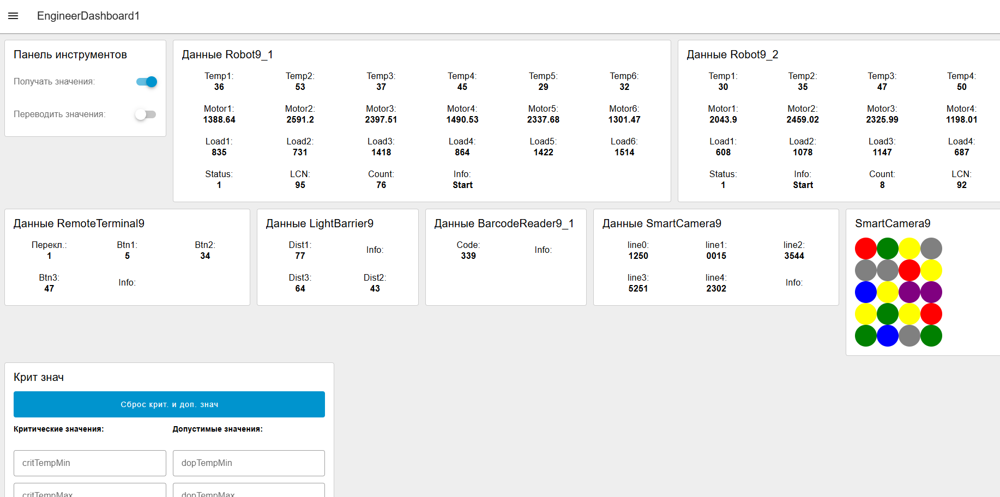

Но есть еще несколько деталей, которые принесут вам больше баллов. Их несложно добавить.

## 1. Индикаторы переключателей

В списке критериев есть критерий, который требует, чтобы у переключателей были индикаторы: какие-то еще виджеты, которые показывают, например включено ли получение данных или выключено. Одного виджета switch недостаточно (хотя мы и видим, что если он голубой, значит включен, если серый - значит выключен). Например, это должен быть дополнитьельный "кружок", подписанный "получение данных", который горит зеленым, если получение данных вкл, иначе - красным. Но проще это сделать с помощью простой текстовой подписи.

Сделаем на премере переключателя получения данных.

При активации этого переключателя у нас записывается его значение true\false в переменную "poluchatSwitch". Давайте добавим функцию, которая будет выводить "ОК" или "Нет данных" в зависимости от этого значения.

Создайте пустой блок function. Код:

```javascript
// если в глобальной переменной true
if (global.get("poluchatSwitch")){
    msg.payload = "ОК" // выводим ОК
} else {
    msg.payload = "Нет данных" // иначе выводим Нет данных
}
return msg;
```

К этой функции прикрепляем ноду text

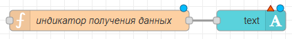

Она должна находиться в той же группе на дашборде, где и переключатель (панель инструментов). Назвать можно например так:

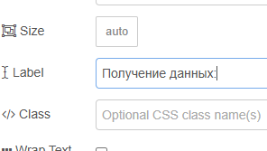

Сама по себе такая конструкция не будет работать:

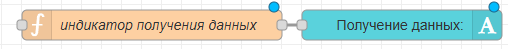

Потому что перед функцией нет никакой ноды, которая бы отправляла ей сообщение (запускала бы ее работу, даже учитывая что функции внутри никаких значений и не нужно, она ведь использует значение глобальной переменной для работы). Нужна нода, которая будет постоянно "обновлять" или "автоматически триггерить" эту функцию. Используем inject:

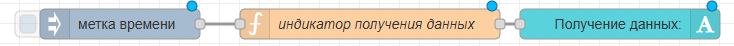

Самое главное - это настройка самого inject. Внутри нужно включить автоматическую отправку сигнала каждую 1 сек:

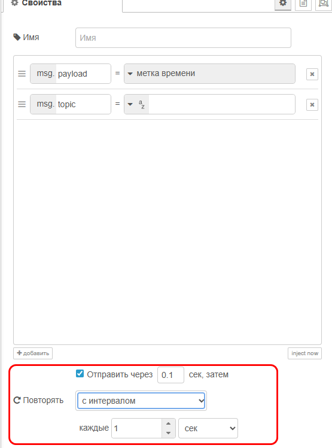

Результат на дашборде:

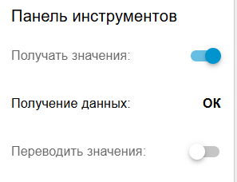

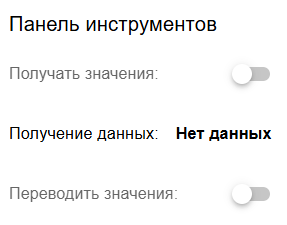

**Аналогично сделайте индикатор для переключателя перевода значений и сохранения данных**

## 2. Интерпретация данных от системы безопасности

От системы безопасности вы получаете 3 значения расстояния (расстояние до препятствия перед датчиками). Нужно добавить текстовый виджет, который будет выводить надпись "Все ок" или "НАРУШЕНИЕ БЕЗОПАСНОСТИ" в зависимости от того, насколько близко находится объект перед датчиками (например, если значение на любом из датчиков <30, то вывести что периметр безопасности нарушен). Кроме того, нужно добавить возможность ввода пользователем этого "минимального" значения расстояния.

Сначала сделаем поле для ввода "критического" значения. Используем уже знакомый виджет form. В нем будет только одно поле:

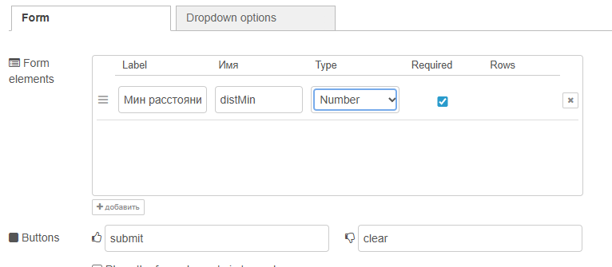

Создайте функцию и присоедините ее к форме на выход. Код будет такой же, как мы делали для форм крит. значений роботов - в глобальную переменную записываем значение из формы:

```javascript
global.set("distMin", msg.payload.distMin)
return msg;
```

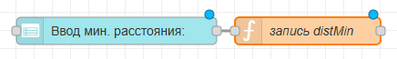

Теперь подготовим функцию и виджет для вывода текста. Должна выводиться надпись "все ок" или, если любое из значений расстояния (d1, d2, d3) меньше глобальной перменной distMin, то надпись "ПЕРИМЕТР НАРУШЕН" (или что-то такое). То есть, брать значения d1, d2, d3 будем из функции получения данных от барьера (которая у вас уже есть просто для вывода значений на экран), затем новая функция для определения статуса и виджет text для вывода статуса на дашборд

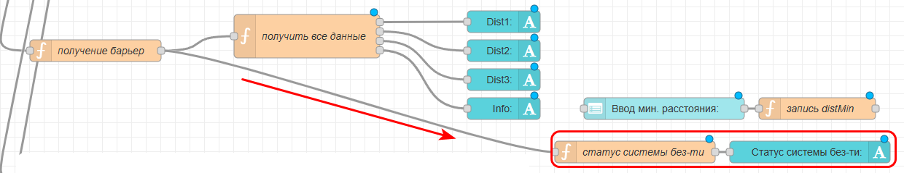

Настройки виджета "text":

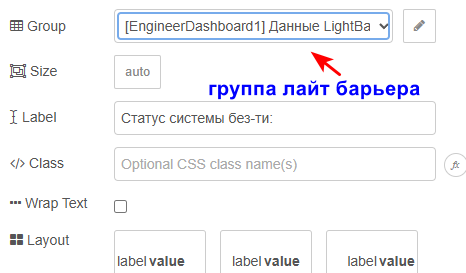

Функция (`если` `d1< distMin ИЛИ d2 < distMin или d3<distMin, то выводим предупреждение, иначе - обычный текст`):

```javascript
if ( msg.payload.d1 < global.get("distMin") ||
     msg.payload.d2 < global.get("distMin") ||
     msg.payload.d3 < global.get("distMin")) {
        msg.payload = "Периметр нарушен!!"
    } else {
        msg.payload = "Все ОК"
    }
return msg;
```

**Также нужно вписать значение distMin по умолчанию в функцию записи значений по умолчанию (где у нас уже при запуске дашборда автоматом записывают critTempMin, critTempMax и остальные)**

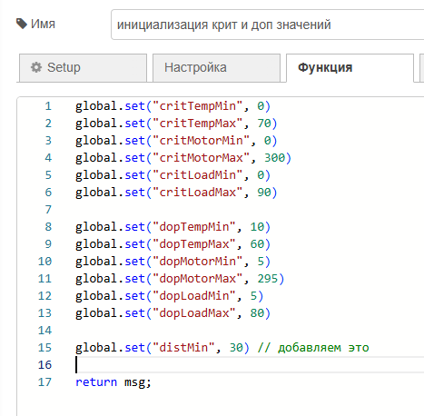

Результат на дашборде:

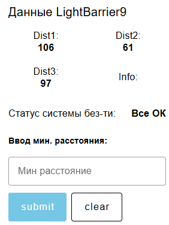

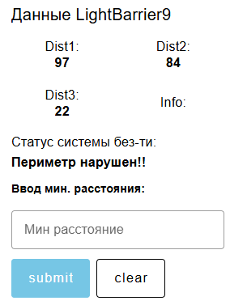

## 3. Интерпретация данных от штрихкод-ридера

Штрихкод-ридер считывает 3-значные коды, каждый код соотвествует какой-то сборке, которую должны выполнить роботы. Список кодов известен заранее на чемпионате. По заданию нам нужно сделать "интерпретиацию данных штрихкод-ридера", это значит, что, в зависимости от пришедшего кода, мы должны выводить рядом надпись, есть ли такой код в списке доступных ("верный"), или такого кода нет ("неверный"), или, если код = "0", то "пустой код".

Для примера возьмем такой список верных кодов:

```
"104", "217", "800", "567", "777"
```

Простейший способ - сделать это так же, как в п. 2 выше, но без глобальных переменных. Добавляем функцию и текстовый виджет и соединяем функцию с функцией получения данных от штрихкод-ридера:

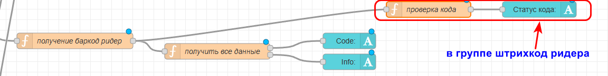

Код функции:

```javascript
if ( msg.payload.c == "104" ||
     msg.payload.c == "217" ||
     msg.payload.c == "800" ||
     msg.payload.c == "567" ||
     msg.payload.c == "777") {
        msg.payload = "Код верный"
    } else if (msg.payload.c == "0"){
        msg.payload = "Пустой код"
    } else {
        msg.payload = "Код неверный!"
    }
return msg;
```

В коде функции мы просто сравниваем msg.payload.c (сам пришедший код) со всеми верными и с "0". **Важно**: не забудьте, что все значения в кавычках - т.к. тип данных текстовый (string).

Вид на дашборде:

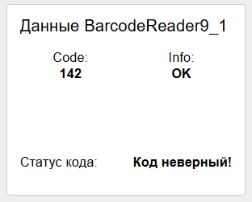

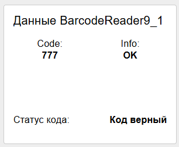

## 4. Интерпретация данных от удаленного терминала

От удаленного терминала мы получаем 4 значения: статус переключателя p (0 или 1, нажат/не нажат), а так же значения b1, b2, b3 - это количество нажатий на кнопки 1, 2 и 3 с момента подключения. Под интерпретацией данных с удаленного терминала понимается:

- вывести не только кол-во нажатий на кнопки b1-b3, но и их текущий статус (нажат/не нажат)
- для переключателя вывести не только числовое значение 1/0, но и словами "нажат"\\"не нажат"

Займемся сначала кнопками.

В node-red есть нода trigger.

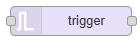

С базовыми настройками она делает следующее: при поступлении в нее любого сообщения она выводит 1, затем ждет определенное время (его можно настроить), после истечения этого времени отправляет 0 (0 и 1 можно заменить на любые сообщения, в т.ч. текстовые).

Ее и используем для вывода статуса нажатия кнопок b1...b3. Когда человек нажимает на любую кнопку, от Remote terminal приходит сообщение с актуальными значениями со всех кнопок. Если конкретная кнопка была нажата, то ее значение увеличится на 1 относительно предыдущего. То есть: если пришло сообщение от remoteterminal  и  новое значение b1, b2 или b3 больше предыдущего, значит кнопка была нажата. А как понять, что значение больше предыдущего? Используем ноду filter

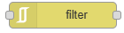

В этой ноде можно выставить такую настройку: передать сообщение дальше, если пришедшее значение больше предыдущего. В итоге собираем такую цепочку:

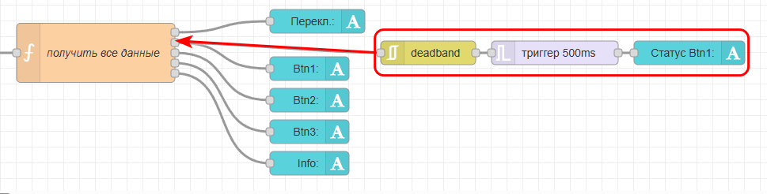

Настройки ноды filter:

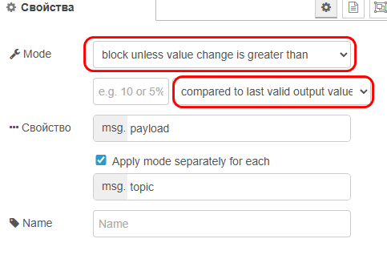

Настройки ноды trigger:

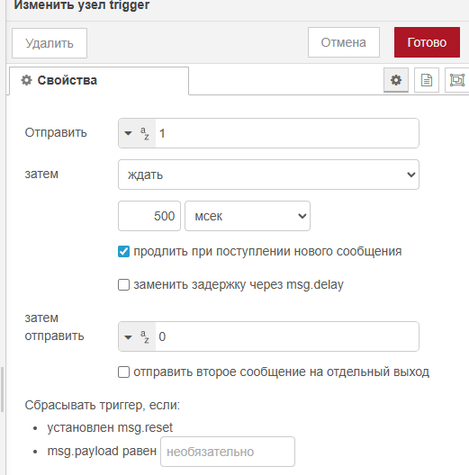

Сделайте самостоятельно то же самое для btn2 и btn3

Результат на дашборде:

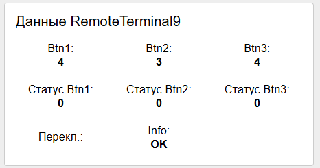

Теперь для переключателя. Нужно выводить не 0\1 а текстом, нажат\не нажат. Сделать это очень просто. Как в предыдущих шагах добавляем функцию и текстовое поле. Соединяем это с функцией получения данных от терминала:

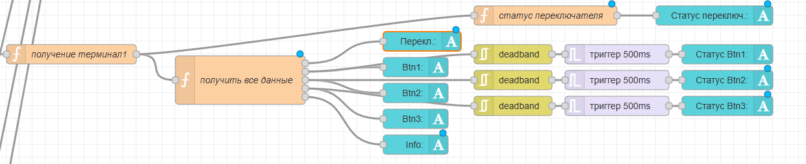

Код функции простейший. Если msg.payload.p = 1, то выводим "нажат", иначе выводим "не нажат":

```javascript
if(msg.payload.p == "1"){
    msg.payload = "Нажат"
} else {
    msg.payload = "Не нажат"
}
return msg;
```

Вид на дашборде:

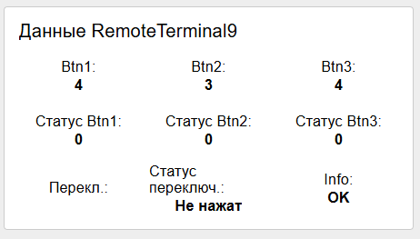

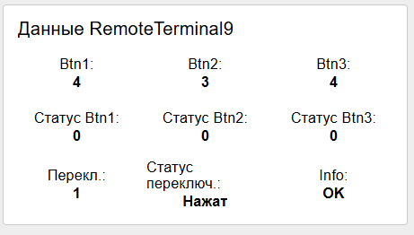

## 5. Переключатель сохранения данных и настройка частоты сохранения данных

По заданию нужно настроить сохранение некоторых сообщений в базу данных. Как это сделать - см. далее раздел 10. Но - часть вы можете реализовать, даже если сохранение данных не будет работать. Нужно сделать две вещи (в группе "панель инструментов"):

- переключатель "Сохранять данные" и его статус (как выше в п.1)
- Виджет number input с названием "Частота сохранения данных"

Вид на дашборде:

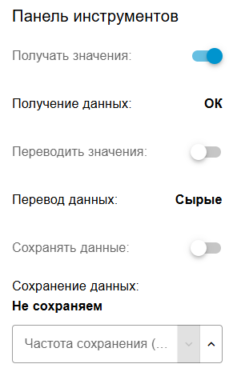
