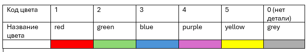
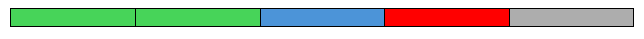
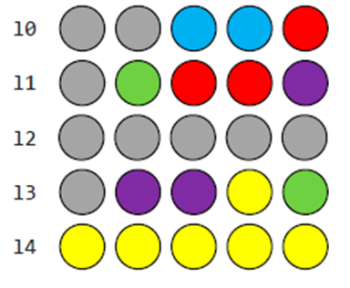
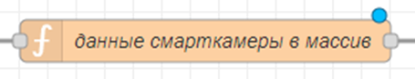
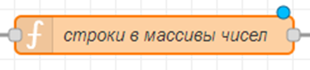
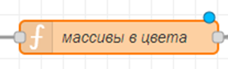
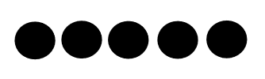
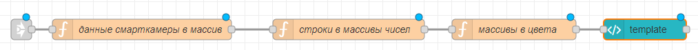
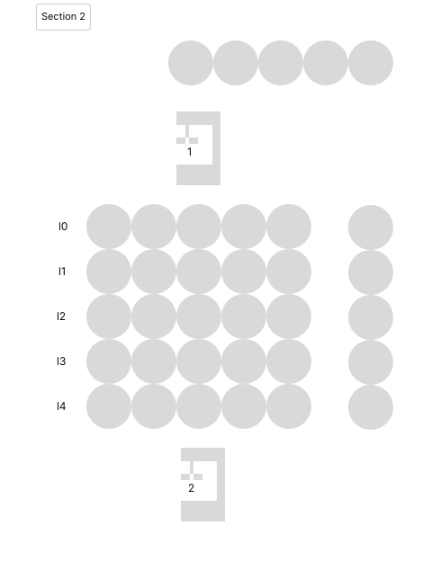

# 8. Отображение данных со смарт-камеры в графическом виде

> Это задача "со звездочкой", потому что занимает много времени и дает не очень много баллов. Не приступайте к ней, если не сделали все остальное

От смарт-камеры в функции «Прием от SmartCamera1» сейчас мы получаем данные и передаем дальше:

```javascript
if (msg.payload.name == "SmartCamera1" && global.get("poluchatSwitch")){
    return msg;
}
```

Данные от смарт-камеры приходят в формате:

```javascript
msg = { payload:
        { 
            name : “SmartCameraX”
            l0 : “00000”,
            l1 : “11111”,
            l2 : “22222”,
            l3 : “33333”,
            l4: “44444”
            }
    }
```

то есть, в переменных с ключами l0…l4 приходят строки, стостоящие из 5 цифр, каждая из цифр соотвествует цвету детали в определенной ячейке перед роботом (l0 -в первой строке, l1 – во второй и т.д.), например, пусть цвета распределены так:



тогда если в l0 пришла строка «22310», это заначит, что детали там лежат вот так:



**Задача: отобразить эти данные в графическом виде на дашборде, примерно так:**



(как будто мы смотрим сверху на площадку перед роботом).

Для этого нужно

1. получаить значения l0…l4 от оборудования (тип: строка , то есть текст)
2. разделить строку вида “ABCDE” в массив вида \[“A”, “B”, “C”, ”D”, “E”]
3. (не обязательно) преобразовать каждый элемент массива в число
4. заменить каждый элемент массива на соотвествующий ему цвет (например было “A” стало “red”)
5. отобразить схему на дашборде с меняющимися цветами в зависимости от значений переменных

#### Шаг 1. Получать значения от оборудования

Получим значения l0…l4 и объединим их в один массив \[l0, l1, l2, l3, l4]:



```javascript
//читаем значения всех линий со смарт камеры
var l0 = msg.payload.l0;
var l1 = msg.payload.l1;
var l2 = msg.payload.l2;
var l3 = msg.payload.l3;
var l4 = msg.payload.l4;

var msg = {payload:
[l0,l1,l2,l3,l4 ]}

return msg;
```

#### Шаг 2 и 3. Разделить строку в массив



```javascript
//создаем функцию, которая будет выполнять преобразование
function strToNumArr(str){
    //создаем переменную и записываем в нее массив, который получается при разделении строки
    var lineArrStr = str.split("")

    //создаем переменную и записываем в нее тот же массив, но со всеми элементами, преобразованными в числа
    var lineArrNum = lineArrStr.map(element => Number(element))

    //функция возвращает массив из чисел
    return lineArrNum
}

//в этой переменной у нас будет храниться массив со всеми строками со смарт-камеры
var arrays = msg.payload

// это массив, в который мы запишем массивы, которые получатся из строк
var finArr = []

//преобразуем каждую строку смарт камеры в массив из чисел
for (var i =0; i<5; ++i){
    finArr.push(strToNumArr(arrays[i]))
}

//передаем дальше сообщение с нашим массивом из 5 массивов
var msg = { payload: finArr }

return msg;
```

#### Шаг 4. Преобразуем массивы из чисел в массивы из цветов

После предыдущего шага получится что-то такое:

```javascript
finArr = [
 [1, 0, 2, 3, 3] , // детали которые лежат в 1 строке
 [2, 2, 2, 2, 2] , // детали во 2 строке
 [3, 4, 0, 0, 0] , // детали в 3 строке
 [2, 4, 1, 2, 3] , // детали в 4 строке
 [4, 0, 0, 0, 1]   // детали в 5 строке
]
```

Теперь каждый элемент каждого массива надо преобразовать в цвет (то есть текст с названием цвета)



Сначала пишем функцию раскраски (в зависимости от числа заменяем его на цвет). Если вы не делали перевод строк в числа на предыдущем этапе, то числа должны быть в кавычках :

```javascript
function numToColor(num){
    var color
    switch (num){
        case 1: 
            color = 'red'
            break;
        case 2: 
            color = 'green'
            break;
        case 3: 
            color = 'blue'
            break;
        case 4: 
            color = 'purple'
            break;
        case 5: 
            color = 'yellow'
            break;
        default:
            color = "grey"
            break;
    }
    return color
}
```

Далее нам нужно примениь эту функцию к каждому элементу и каждый элемент передать дальше с уникальным названием, например l00 –0я строка 0й столбец, l01 – 0я строка 1й столбец и т.д.

Считаем данные из предыдущей функции (то есть массив с массивами):

```javascript
var finArr = msg.payload
```

Будем передавать дальше сообщение следующего вида:

```javascript
var msg = {
    l00: numToColor(finArr[0][0]), //деталь в позиции l00 имеет цвет такой
    l01: numToColor(finArr[0][1]),
    l02: numToColor(finArr[0][2]),
    l03: numToColor(finArr[0][3]),
    l10: numToColor(finArr[1][0]),
    l11: numToColor(finArr[1][1]),
    l12: numToColor(finArr[1][2]),
    l13: numToColor(finArr[1][3]),
    l20: numToColor(finArr[2][0]),
    l21: numToColor(finArr[2][1]),
    l22: numToColor(finArr[2][2]),
    l23: numToColor(finArr[2][3]),
    l30: numToColor(finArr[3][0]),
    l31: numToColor(finArr[3][1]),
    l32: numToColor(finArr[3][2]),
    l33: numToColor(finArr[3][3]),
    l40: numToColor(finArr[4][0]),
    l41: numToColor(finArr[4][1]),
    l42: numToColor(finArr[4][2]),
    l43: numToColor(finArr[4][3])
}
```

#### Шаг 5. Раскраска и вывод

В любом svg редакторе подготавливаем изображение (далее буду показывать на примере 1 строки):



[https://svgcodeeditor.com](https://svgcodeeditor.com)

Открываем svg файл в блокноте и копируем его код в node red в ноду template:

Далее код надо преобразовать

Каждый кружок задается строкой \<ellipse …>

Было так:

```html
<ellipse style="fill:#000000;stroke-width:0.230516" id="path1" cx="3.4901211" cy="4.0684972" rx="2.0324528"
    ry="1.898834" />
```

- style fill – цвет заливки
- style stroke – толщина обводки
- id – название элемента, чтобы не запутаться
- cx – координата y центра, зависит от того, как мы расположили кружок на картинке
- cy – координата Y центра эллипса, зависит от того, как мы расположили кружок на картинке
- rx, ry – радиусы по оси X и Н
- координаты и радиусы не меняем.
- тег style удаляем полностью
- в конце перед /> добавляем отдельный тег :fill и он равняется “msg.l00” (или вместо l00 другая переменная)

В результате для одного эллипса:

```html
<ellipse id="l00" cx="3.4901211" cy="4.0684972" rx="2.0324528" ry="1.898834" :fill="msg.l00"/>
```

повторяем для всех эллипсов

готово!

Итоговый код:



На картинке с видом сверху кроме динамически меняющих цвет кружочков так же нужно изобразить роботов (статических), для выполнения критеря о полноценном виде сверху. Примерный вид (без раскраски):


