# 9. Отображение подключенности оборудования

По заданию необходимо выводить информацию о том, подключено ли оборудование (текущий статус, например онлайн/оффлайн). Для регионального чемпионата достаточно выводить один статус по всему оборудованию, для национального - отдельно по каждой единице оборудования.

## Способ 1: только для всего оборудования сразу

В node red у некоторых нод есть "статус". Это то, что отображается во время работы под нодой в рабочей области проекта. Например, у ноды IOT Get есть статус connected|disconnected:

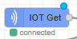

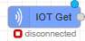

Прямо этот статус мы и можем вывести на дашборд. Для этого нужно использовать ноду "status":

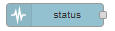

Перетащите ее в рабочую область, настройка:

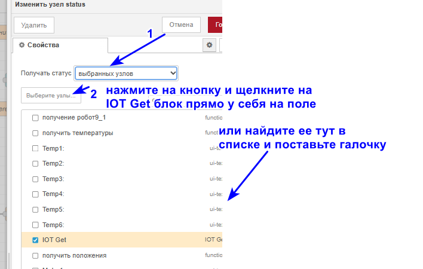

Далее нужно вывести само слово статуса на дашборд. Для этого после ноды status добавляем функцию, код:

```javascript
msg.payload = msg.status.text // именно тут хранится слово connected\disconnected
return msg;
```

Далее просто выводим его на экран в группе "Панель инуструментов":

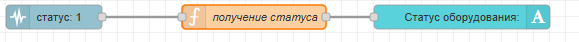

Вид на дашборде:

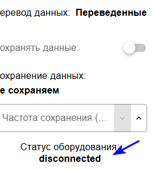

## Способ 2: можно для каждого устройства отдельно

Второй вариант - смотреть на данные, если приходят, например, последние 10-30 секунд, значит подключено, если не приходят, значит отключено.

Добавляем ноду trigger после IOT get (ответвление, параллельно остальным блокам):

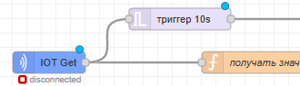

Настройка ноды:

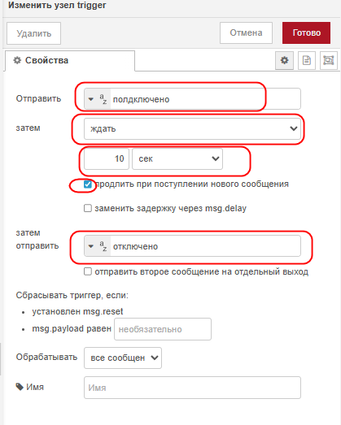

Триггер сработает, если в него придут данные (в этом примере если что-то придет из IOT get). После этого он отправит сообщение "подклбчено". Далее он ждет 10 секунд. Если за это время пришли еще данные, он начинает отсчет заново. Если же данных нет и таймер досчитал до 10 сек, то триггер отправляет сообщение "отключено". Затем все повторяется.

После триггера присоединяем ноду для вывода на дашборд (в группе "Панель инструментов"):

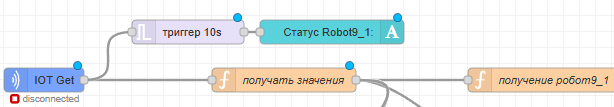

Вид на дашборде:

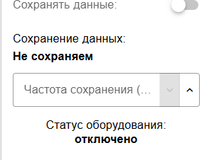

Чтобы сделать все идеально и красиво, стоит еще оставить заметку для пользователя, что при отключении ожидание данных длится 10 сек и после этого статус меняется (с помощью ноды template):

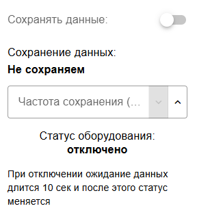

Если вы хотите вывести отдельно статус по каждой единице оборудования, просто перенесите ноды триггера и вывода на дашборд, вот эти:

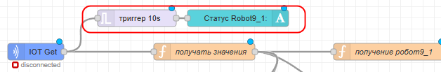

Не после IOT get, а после каждой функции получения данных от оборудования, например:

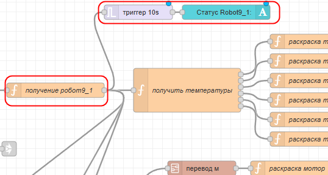

Тогда на дашборде стоит их разместить в группах каждого устройства отдельно:

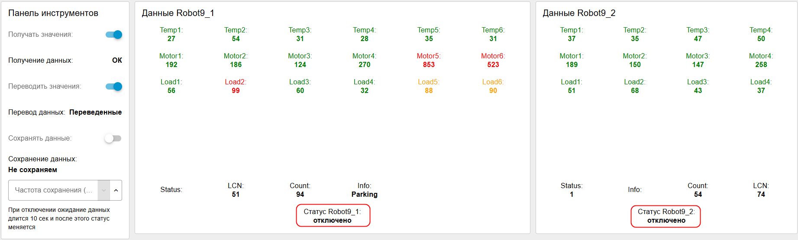
