# 1. Передача данных на оборудование (роботы)

## Общая информация

Начинаем делать второй дашборд - из задания модуля В - дашборд оператора.  Создайте новую вкладку в проекте, и все, что касается нового дашборда, делайте в ней:

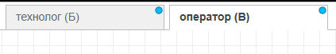

Также не забудьте при создании всех новых виджетов дашборда (голубые блоки) выбирать новый дашборд.

**Названия дашбордов, так же как и названия устройств, прописаны в задании. Документ "ТЗ на интерфейсы пользователя"** [**ссылка**](https://docs.google.com/document/d/1hf7PpPOBksTZplMGEmMzjsTOLlzWrcZaCc_DS75tM3o/edit?tab=t.0)

## Управление роботом

Для того, чтобы **передать** команду на оборудование, используется нода IoT Send:


Чтобы команду передать, надо ее сначала **сформировать**. Это делает розовая нода IoT Function.

А что именно передавать? Начнем с роботов. Для управления роботом в реальности в декартовой системе координат нужно три координаты (координаты точки, в которую должен приехать захват): X, Y и Z. Для роботов, которые используются на чемпионате, есть два режима:

- Координатный: передаем значения X, Y, Z в миллиметрах а так же V (0 = открыть захват, 1 = закрыть захват) и T (угол поворота захвата). То есть в сумме **5 значений**.
- По точкам (POI): все возможные положения (точки) робота уже внесены в таблицу и пронумерованы. Для управления передаем X - номер точки из списка, и V (открыть/закрыть захват). То есть в сумме **2 значения**.

Режим управления зависит от чемпионата. **На чемпионате в 2026 году используется управление по точкам!**

**Эта информация прописывается в задании в файле "**[**описание протокола передачи данных**](https://docs.google.com/document/d/1MCsBnMAGz0kk5jDI5Vdmp_kLaAI-CokEeIhReUpIcCA/edit?tab=t.0)**"** (столбец "параметры для управления)

Внутри IOT Function вы можете задать вручную значения параметров, которые хотите передать на робота. Обязательно введите правильное имя робота!

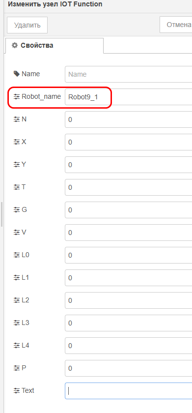

Прямо здесь же можно указать фиксированные значения X (номер точки) и V, чтобы именно их передать на робота. Но, конечно, такой вариант не удобен - значения управления для робота будут постоянно меняться вручную и автоматически.

Итак, по заданию нам нужно реализовать:

- Ручное управление: ввел номер точки - робот поехал
- Ручное управление: выбрал точку из списка - робот поехал (да, нужно реализовать оба варианта)
- Автоматическое управление: ввели код, нажали "старт" - робот поехал в одну точку, потом в другую и т.д.

Начинаем с ручного режима.

Чтобы пользователь ввел номер точки, нужно создать поля для ввода. Можно использовать ноды text input, number input. Каждый из этих виджетов представляет собой одно поле для ввода/выбора значения + по умолчанию передает значение сразу после ввода. Для примера далее буду использовать number input

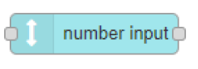

Настройки:

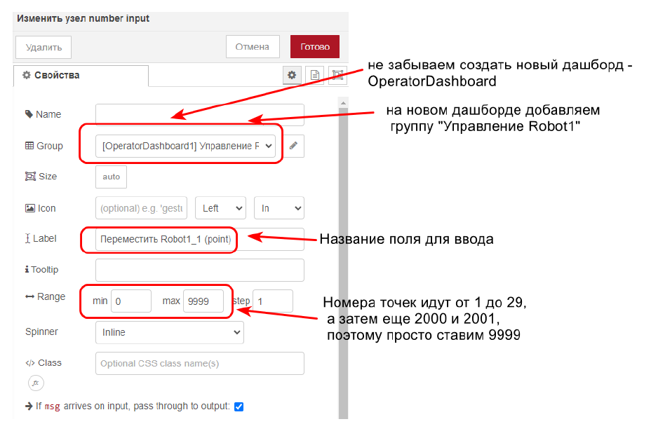

Нода IOT Function может принять значения свойств для управления не только из окошек для ввода при двойном клике, как мы сделали в начале. Чтобы передать какое-то значение в какое-то свойство, нужно передать значение в msg.topic<название поля>.

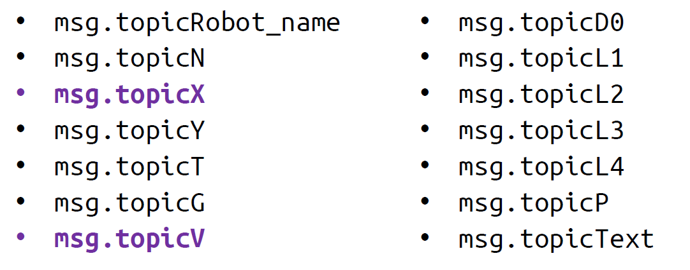

Итак, наше поле для ввода выдает значения в msg.payload, а розовая функция передачи данных принимает в msg.topicX. Значит, нужна функция «передать координаты», которая будет записывать значения из поля в нужном виде для робота:

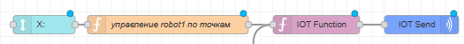

```javascript
msg.topicX = msg.payload;
return msg;
```

В таком виде код все еще не будет работать, потому что для управления нужно передавать полный пакет значений, а он состоит из:

- Номер точки (X) (это уже сделали)
- Команда открыть\закрыть захват (V)

Передавать команду на захват можно разными способами, например кнопкой button, переключателем switch, текстовым или числовым полем. Для примера будем использовать switch:

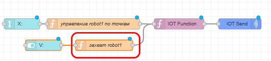

Функция (помним, что switch выдает true\false, а в розовую функцию обязательно должно идти 0 или 1):

```
if (msg.payload){
    msg.topicV = 1
} else {
    msg.topicV = 0
}
return msg;
```

Но и это еще не все. Мы сказали, что для работы управления, нужно чтобы **за 1 раз** передавались **все значения** (и X и V).

То есть, например, если мы хотим открыть захват, но робот при этом должен стоять на месте, мы все равно должны передать **не только команду** «открыть захват» (V = 0), **но и значение X**, чтобы робот стоял на месте. Но каждая из функций сейчас передает либо только V, либо только X.

Если робот должен открыть захват, мы передаем V = 0. При этом он должен стоять на месте -> значит значение Х, которое мы передадим, должно быть таким же, какое есть сейчас.

То есть, если робот стоит в точке 1 (текущий X = 1) и мы управляем захватом , но не хотим движения, то мы еще раз передаем в Х значение 1 (то есть **текущее** значение X снова записываем в X)

А как узнать текущее значение Х? И где его хранить?
 Добавляем функцию "запись текущих в глобальные" и ставим ее после розовой функции

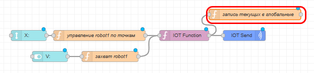

Внутри этой функции будем записывать значения `topicX` и `topicV` (после функции IoT control) в глобальные переменные `curX1` и `curV1` (1 потому что робот №1, у робота №2 будет curX2 и curV2).

Код функции:

```javascript
global.set('curX1', msg.topicX)
global.set('curV1', msg.topicV)
return msg;
```

И мы так же хотим видеть, какие значения X и V сейчас имеет робот, поэтому добавим так же текстовые поля для отображения:

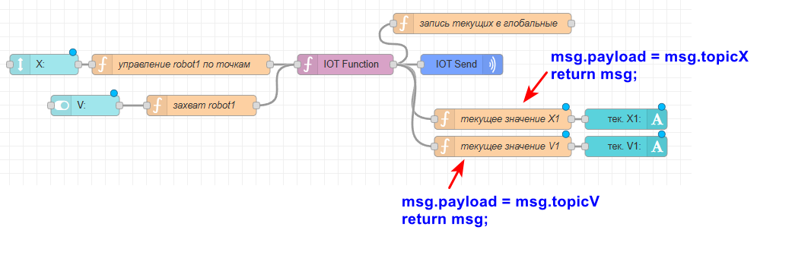

Наконец, нужно сделать «инициализацию». Пусть при запуске проекта все координаты примут начальное значение (это обязательно, чтобы все работало как нужно далее в авто режиме).

Напишем функцию "инициализация координат":

```javascript
msg.topicV = 0; // пусть по умолчанию захват будет закрыт, так он меньше греется
msg.topicX = 2000; // это номер точки “старт”
return msg;
```

Присоединяем это к ноде inject, в настройках ноды ставим галочку "отправить через 0.1 сек"

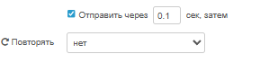

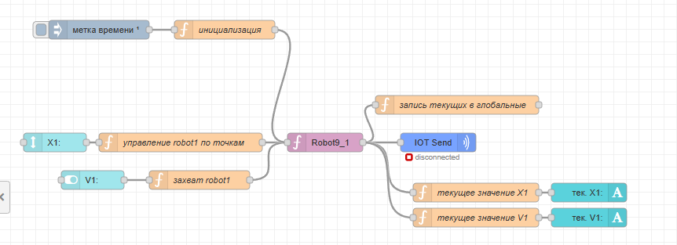

Зачем мы делали глобвальные - чтобы отправлять весь пакет значений на робота сразу. Идем в функцию отправки X.

**Было**:

```javascript
msg.topicX = msg.payload;
return msg;
```

Добавляем отправку curV1 в topicV. **Стало**:

```javascript
msg.topicX = msg.payload;
msg.topicV = global.get("curV1"); // добавили отправку текущего V в V
return msg;
```

Аналогично с функцией отправки V. **Было**:

```javascript
if (msg.payload){
    msg.topicV = 1
} else {
    msg.topicV = 0
}
return msg;
```

**Стало**:

```javascript
if (msg.payload){
    msg.topicV = 1
} else {
    msg.topicV = 0
}
msg.topicX = global.get("curX1") // добавили отправку текущего X в X
return msg;
```

Результат на дашборде:

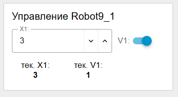

> Перед тем, как идти дальше, проверьте работоспособность.
>
> 1. Сначала проверка на дашборде. Отправьте любое значение X и V. Оба значения должны отображаться на дашборде в текущих (кроме 0, 0 может быть не виден). Убедитесь, что при отправке X у вас не пропадает автоматически V и наоборот.
> 2. Проверка в IoT Control Center. Отправьте любые значения. В Control Center они должны прийти в нескольких окошках
> 3. Проверка на роботах. Убедитесь, что захват открывается/закрывается и робот едет в нужные точки. Также проверьте работоспособность точек 2000 и 2001

Самостоятельно сделайте управление для робота 2 (аналогично). Не забудьте для 2 робота так же добавить инициализацию!!

## Инициализация

См в статье 3 [3.-inicializaciya-sistemy-i-pereklyuchatel-peredachi-dannykh.md](3.-inicializaciya-sistemy-i-pereklyuchatel-peredachi-dannykh.md "mention")

