# 2. Передача данных на оборудование (прочее оборудование)

Таким же образом делается управление для всех остальных единиц оборудования. Смотрите в файле "Описание протокола обмена данными" во второй столбец для каждого устройства - там все параметры, которыми можно управлять. Смотрите на описание значений - если какой-то параметр - это число, значит стоит использовать виджет text input или number input. Если значение может быть только 0 или 1, логично использовать switch.

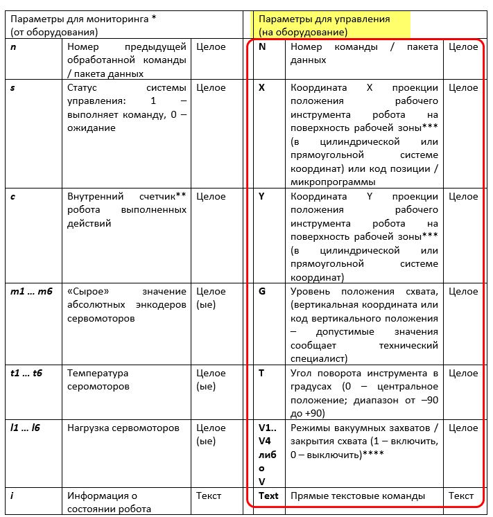

Далее рассмотрено отдельно каждое устройство.

Управление светофорами

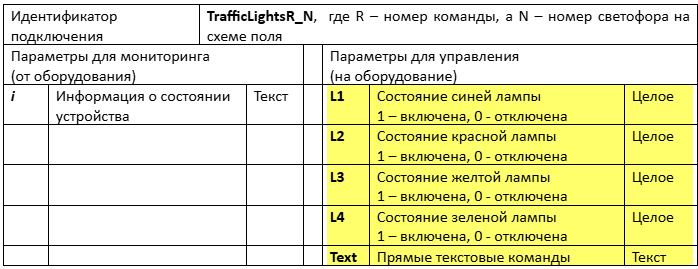

У светофоров TrafficLightsX\_1 и TrafficLightsX\_2 есть 4 свойства для управления = это 4 лампы = L1, L2, L3, L4

- Если в них пришло число 1, то лампа включается
- Если пришло число 0, то лампа выключается

Добавляем розовую функцию и IOT Send:

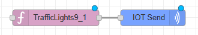

<mark style="background-color:$warning;">Внутри розовой функции укажите название светофора в поле Robot\_name!!!!</mark>

Далее разбираемся со способом ввода значений.

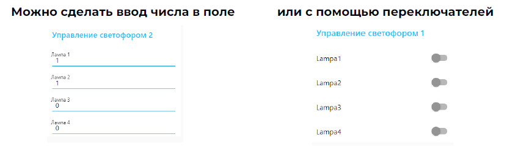

Показываю на примере switch.

Настройка виджета:

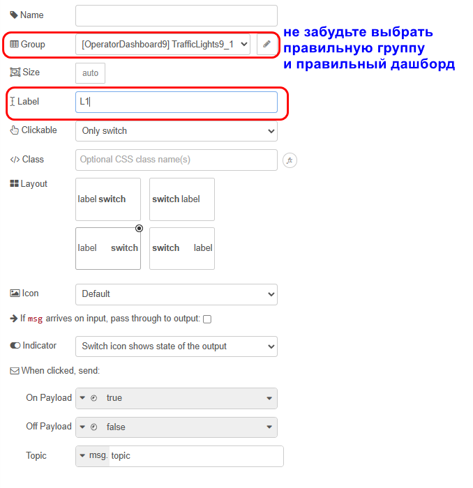

Далее нам нужна функция "передача L1". В этой функции будем делать две вещи

- во первых - switch передает true\false, а нам нужно 1\0, то есть нужно преобразовать
- во-вторых, отправить значение в нужный топик (для L1 это msg.topicL1)
- в-третьих, как и с роботом, отправлять нужно весь пакет данных (L1...L4), а не только L1

Код функции:

```javascript
msg.topicL1 = Number(msg.payload) //отправляем в topicL1 значение от переключателя, но преобразованное в число
msg.topicL2 = global.get("curL12") // в другие лампы отправляем их же текущие значения
msg.topicL3 = global.get("curL13")
msg.topicL4 = global.get("curL14")

return msg;
```

Переменных curL12...curL14 пока нет, их добавим позже (по такому же принципу как делали с роботом)

То же самое копируем для остальных ламп (не забывая менять в коде названия переменных):

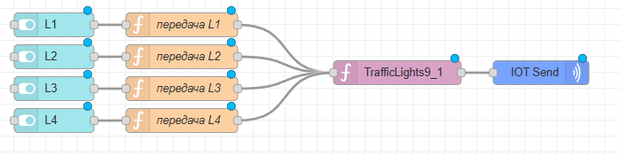

Ну и наконец нам нужно записывать текущие значения ламп в глобальные (curL11...curL14), чтобы управление работало. Добавляем функцию "запись текущих в глобальные", подсоединяем ее на выход розовой функции:

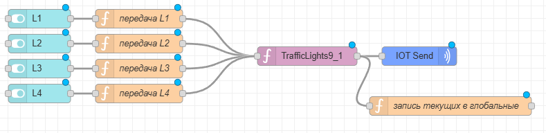

Название переменных я выбрала такие, потому что светофора 2 шт. У первого светофора будет curL11...curL14, а у второго curL21...curL24 (первое число - номер светофора, второе - номер лампы этого светофора)

Код функции:

```javascript
global.set('curL11', msg.topicL1)
global.set('curL12', msg.topicL2)
global.set('curL13', msg.topicL3)
global.set('curL14', msg.topicL4)
return msg;
```

Не забываем, так же как с роботами, сделать инициализацию. При запуске дашборда в L1...L4 передаем нули:

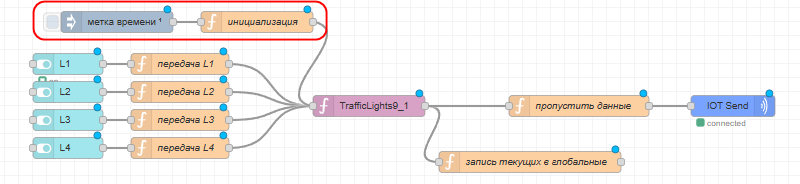

Код функции:

```javascript
msg.topicL1 = 0; 
msg.topicL2 = 0;
msg.topicL3 = 0;
msg.topicL4 = 0;
return msg;
```

Все копируем и делаем то же самое для второго светофора, но не забудьте поменять название светофора в розовой функции и во всех оранжевых функциях названия глобальных на curL21...curL24 (не забудьте про инициализацию)

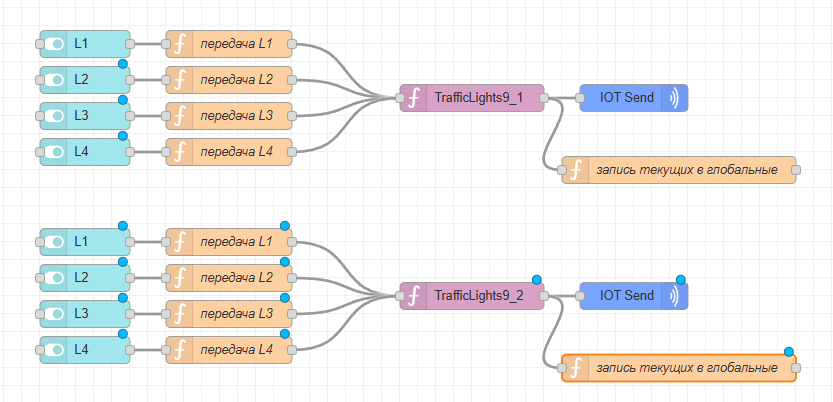

## Управление терминалом

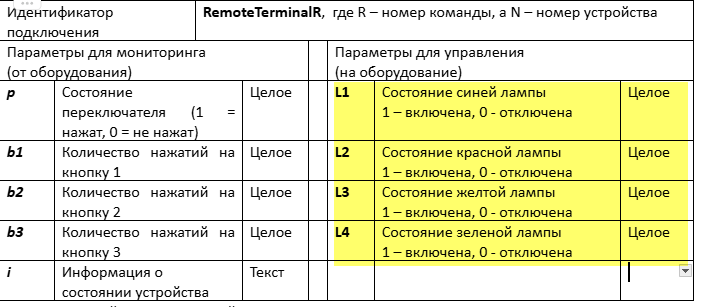

У терминала управляются только четыре лампы (L1...L4). Делаем так же как со светофорами, только меняем название в розовой функции и названия глобальных переменных.

Вид:

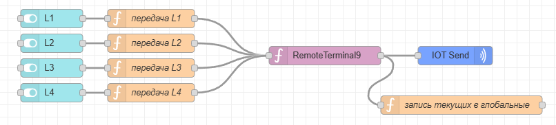

**Не забудьте про инициализацию!!**

## Управление смарт камерой

Смарт камера не присылает данные постоянно, в отличие от остального оборудования. Она присылает данные по запросу, а так же у нее есть счетчик кадров, который можно сбрасывать. У нее только одно свойство для управления этим всем:

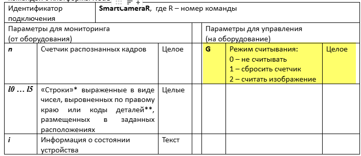

Проще всего сделать одно текстовое поле, в которое будет вводиться число от 0 до 2 и отправляться на устройство.

Сначала добавляем розовую функцию и IOT send как и с другими устройствами:

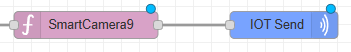

Затем добавляем виджет text и функцию:

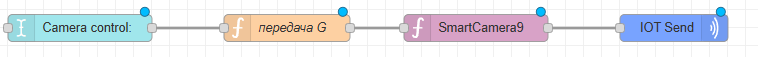

Код функции (просто передаем введенное значение в нужный топик):

```javascript
msg.topicG = msg.payload
return msg;
```

Поскольку пользователь может не знать, какая команда что делает, можно добавить текстовое пояснение. Для этого используется виджет template.

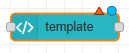

 Расположите его в нужной группе и напишите свой текст:

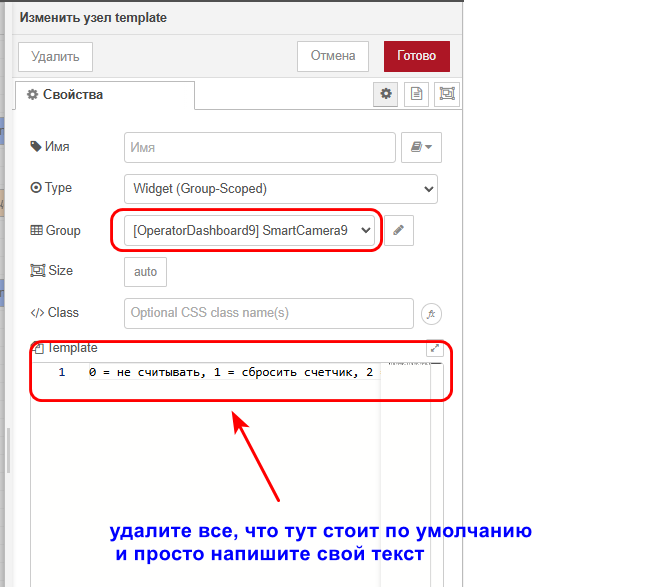

Итог на дашборде:

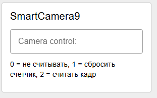

На этом этапе все управление всеми единицами оборудования в ручном режиме реализовано. Примерный вид дашборда:

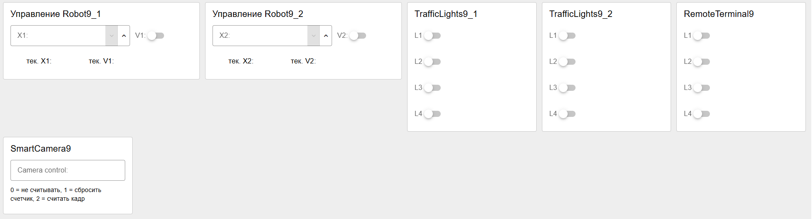

НЕ ПЕРЕХОДИТЕ К СЛЕДУЮЩЕМУ ЭТАПУ, ЕСЛИ ВСЕ ФУНКЦИИ ИЗ СТАТЕЙ 1 И 2 У ВАС НЕ РАБОТАЮТ. СНАЧАЛА ПРОВЕРЬТЕ РАБОТОСПОСОБНОСТЬ
