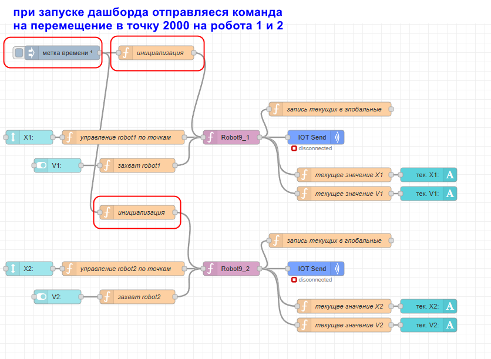
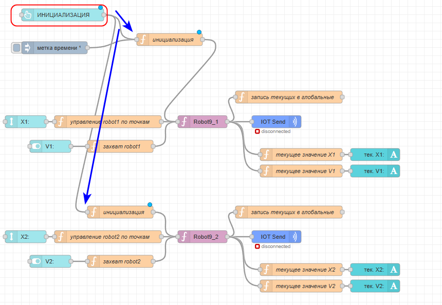
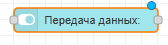
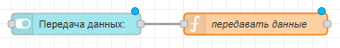
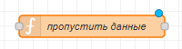
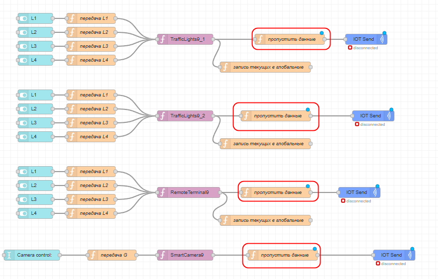
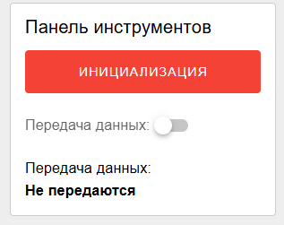

# 3. Инициализация системы и переключатель передачи данных

## 1 Инициализация

По заданию нужно реализовать инициализацию системы по нажатию одной кнопки. Инициализация - это задание начальных положений роботов. У нас это уже сделано по запуску дашборда:



Нужно просто добавить на панель инструментов (на каждом дашборде должна быть панель инструментов) кнопку "ИНИЦИАЛИЗАЦИЯ", по нажатию на которую будут выполняться те же самые функции. Добавляем button и соединяем:



2 Переключатель передачи данных

Как на первом дашборде технолога был переключатель получать/не получать данные, так и здесь нужен аналогичный, но на отправку даннных. Добавляем переключатель:



К нему функцию для записи значения в глобальную переменную:



Код функции:

```javascript
global.set("controlSwitch", msg.payload)
return msg;
```

Теперь подготовим функцию, которая будет разрешать блокировать передачу данных в зависимости от значения этой глобальной переменной controlSwitch:



```javascript
if (global.get("controlSwitch")){
    return msg;
}
```

Эту функцию мы ставим перед каждым IOT Send, которые уже есть и новых, которые потом появятся в коде! Для роботов и для всех остальных устройств:



Для переключателя так же нужно сделать индикатор, как в статье [10.-dopolnitelnye-elementy.md](../modul-b.-inzhener-tekhnolog/10.-dopolnitelnye-elementy.md "mention")



Перед тем, как идти дальше, не забудьте проверить работоспособность переключателя передачи данных! И не забывайте его включать!!
