# 4. Автоматическая сборка (базовая)

Основной режим работы  полигона - автоматическая сборка

Суть задачи:

- Пришел код, например, 633
- Каждому коду соответствует какая-то сборка
- Когда приходит код, робот должен собрать эту сборку из нужных деталей

> Здесь и далее будет принято такое задание:

В этой статье рассмотрен более простой с точки зрения программирования, но более "нудный" и негибкий способ реализации автоматического режима

1. ### Ввод кода сборки

Создаем поле для ввода кода сборки. Для него делаем отдельную группу «Управление авто сборкой»:

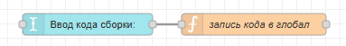

Код функции:

```javascript
global.set("code", msg.payload)
return msg;
```

2. ### Выводим, какой сейчас выбран код

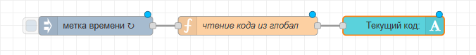

Настройки ноды inject:

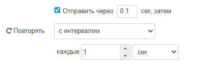

Код функции:

```javascript
msg.payload = global.get("code")
return msg;
```

Получится так:

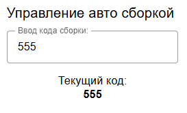

3. ### Алгоритм сборки

Сборка всегда выполняется по определенному алгоритму. Робот должен взять первую деталь, переместить ее в нужную точку. затем взять вторую деталь, переместить ее во вторую точку. И так далее. Итого алгоритм для одной детали:

1\) <mark style="background-color:blue;">Приехать в точку 1 (верх)</mark>\
2\) <mark style="background-color:orange;">Приехать в точку 1 (опуститься)</mark>\
3\) <mark style="background-color:purple;">Включить захват</mark>\
4\) <mark style="background-color:yellow;">Приехать в точку 1 (верх)</mark>\
5\) <mark style="background-color:blue;">Приехать в точку 2 (верх)</mark>\
6\) <mark style="background-color:orange;">Приехать в точку 2 (опуститься)</mark>\
7\) <mark style="background-color:purple;">Выключить захват</mark>\
8\) <mark style="background-color:yellow;">Приехать в точку 2 (верх)</mark>

Одинаковым цветом выделены одинаковые действия, но в разных точках. Тогда алгоритм для одной точки:

1\) <mark style="background-color:blue;">Приехать в точку (верх)</mark>\
2\) <mark style="background-color:orange;">Приехать в точку (опуститься)</mark>\
3\) <mark style="background-color:purple;">Включить/выключить захват</mark>\
4\) <mark style="background-color:yellow;">Приехать в точку (верх)</mark>

4. ### Реализация сборки

#### Шаг 1. Функция сборки

Создаем функцию. В ней будут написаны команды для сборки № ХХХ (номер кода). Здесь и дальше для примера пусть будет код 455.

Внутри этой функции нам надо реализовать алгоритм, который написан выше. В итоге этих функций будет столько же, сколько кодов. И так же нужна кнопка «старт», по которой будет начинаться любая сборка. Добавляем кнопку и функцию:

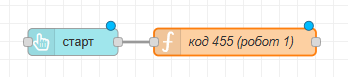

Теперь заполняем блок функции "код 455 (робот 1)".

Внутри этой функции будет алгоритм сборки и несколько вспомогательных функций для него.

Сначала нам понадобится функция, которая будет делать задержку времени (как delay в ардуино) между действиями (потому что роботу нужно время чтобы подняться\опуститься\проехать из точки в точку).

Пишем  это в начале кода функции "код 455":

```javascript
const sleep = (waitTimeInMs) => new Promise(resolve => setTimeout(resolve, waitTimeInMs));
```

Эту строку просто надо выучить!!

Чтобы ее использовать в нужном месте напишем строчку (в скобках время в милисекундах) (это просто пример, пока это никуда не пишем):

```javascript
await sleep(1000);
```

Создадим ниже там же еще одну функцию - `move`, которая будет двигать робота в нужную точку и одновременно оставлять прежним значение захвата (открыт\закрыт)

```javascript
function move(tochka) {
    msg.topicX = tochka;
    msg.topicV = global.get("curV1");
    node.send(msg); // то же самое, что return msg
}
```

`node.send(msg)` - это команда завершения функции и отправки данных дальше, как и return msg, но return может быть только один на весь код и только в конце кода, а в виде node.send - несколько и в любых местах.

Последняя функция `actVacuum` будет открывать и закрывать захват. Логика такая:

- если захват был закрыт (=1), то открыть
- если захват был открыт (=0), то закрыть.

```javascript
function actVacuum(){
    msg.topicX = global.get("curX1"); // номер точки оставляем равным текущему
    if (global.get("curV1") == 1) { //если захват был закрыт (=1)
        msg.topicV = 0; // то открыть
    } else if(global.get("curV1") == 0) { //если захват был открыт (=0)
        msg.topicV = 1; // то закрыть
    }
    node.send(msg);
}
```

Итого код на данный момент:

```javascript
const sleep = (waitTimeInMs) => new Promise(resolve => setTimeout(resolve, waitTimeInMs));

function move(tochka) {
    msg.topicX = tochka;
    msg.topicV = global.get("curV1");
    node.send(msg);
}

function actVacuum(){
    msg.topicX = global.get("curX1");
    if (global.get("curV1") == 1) {
        msg.topicV = 0;
    } else if(global.get("curV1") == 0) {
        msg.topicV = 1;
    }
    node.send(msg);
}

return msg; // УДАЛИТЬ ЭТУ СТРОЧКУ
```

Используя функции, которые мы написали ранее, алгоритм можно представить в таком виде:

1. <mark style="background-color:blue;">Приехать в точку 1 = move(точка1\_верх)</mark>
2. <mark style="background-color:orange;">Опустить захват = move(точка1\_низ)</mark>
3. <mark style="background-color:purple;">Включить захват = actVacuum()</mark>
4. <mark style="background-color:yellow;">Поднять захват = move(точка1\_верх)</mark>
5. <mark style="background-color:blue;">Приехать в точку 2 = move(точка2\_верх)</mark>
6. <mark style="background-color:orange;">Опустить захват = move(точка2\_низ)</mark>
7. <mark style="background-color:purple;">Выключить захват = actVacuum()</mark>
8. <mark style="background-color:yellow;">Поднять захват = move(точка2\_верх)</mark>

Между всеми этими действиями нужно вставить паузу от 1 до 5 секунд (подбираем экспериментально).

Пример:

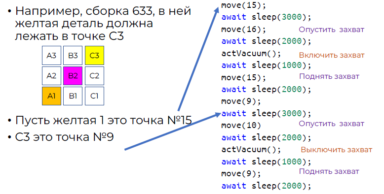

И так далее всю сборку целиком (детали, которые может переместить 1й робот). Итоговый код должен выглядеть примерно так:

```javascript
const sleep = (waitTimeInMs) => new Promise(resolve => setTimeout(resolve, waitTimeInMs));

function move(tochka) {
    msg.topicX = tochka;
    msg.topicV = global.get("curV1");
    node.send(msg);
}

function actVacuum(){
    msg.topicX = global.get("curX1");
    if (global.get("curV1") == 1) {
        msg.topicV = 0;
    } else if(global.get("curV1") == 0) {
        msg.topicV = 1;
    }
    node.send(msg);
}

// алгоритм движения робота
move(15);
await sleep(3000);
move(16);
await sleep(2000);
actVacuum();
await sleep(1000);
move(15);
await sleep(2000);
move(9);
await sleep(3000);
move(10)
await sleep(2000);
actVacuum();
await sleep(1000);
move(9);
await sleep(2000);
... и т.д.
```

Для того, чтобы функция начала выполняться только при поступлении кода = 455, возьмем весь алгоритм в if:

```javascript
const sleep = (waitTimeInMs) => new Promise(resolve => setTimeout(resolve, waitTimeInMs));

function move(tochka) {
    msg.topicX = tochka;
    msg.topicV = global.get("curV1");
    node.send(msg);
}

function actVacuum(){
    msg.topicX = global.get("curX1");
    if (global.get("curV1") == 1) {
        msg.topicV = 0;
    } else if(global.get("curV1") == 0) {
        msg.topicV = 1;
    }
    node.send(msg);
}

if (global.get("code") == '455'){ // движение начнется только если поступил нужный код
    // алгоритм движения робота
    move(15);
    await sleep(3000);
    move(16);
    await sleep(2000);
    actVacuum();
    await sleep(1000);
    move(15);
    await sleep(2000);
    move(9);
    await sleep(3000);
    move(10)
    await sleep(2000);
    actVacuum();
    await sleep(1000);
    move(9);
    await sleep(2000);
}
```

В конце функцию «код 455» (робот1) соединяем с розовой функцией управления робота 1:

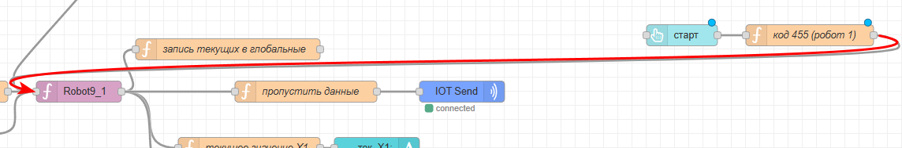

#### Шаг 2. Продолжение вторым роботом

Далее все продолжается вторым роботом. Как сделать так, чтобы робот 2 продолжил? Добавляем функцию (пока пустую) "код 455 (робот2)", спереди к ней прицепляем ножу "complete" (зеленую).

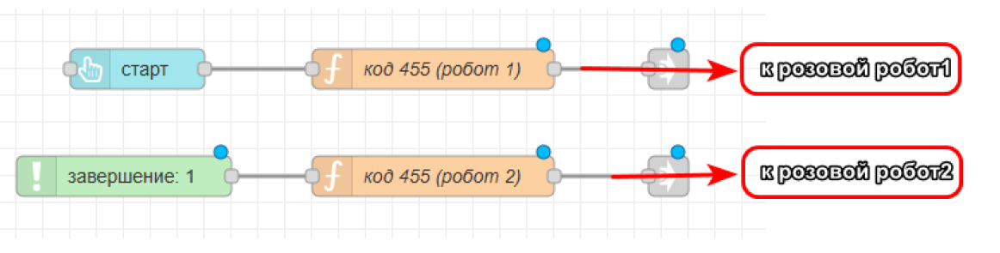

В настройках ноды complete выбираем функцию "код 455 робот1"

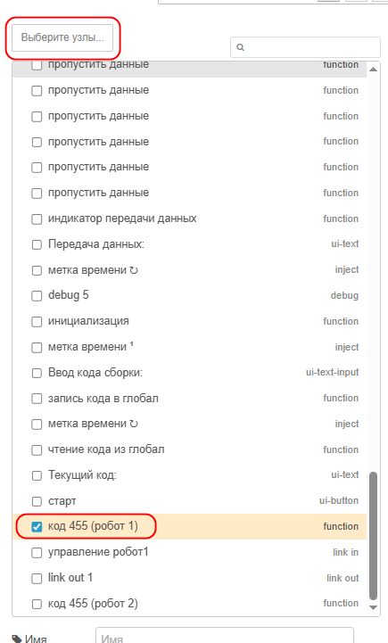

Эта нода пускает сигнал дальше после завершения выбранной в списке функции. То есть функция "код 455 (робот2)" начнет работу после завершения функции "код 455 (робот1)".

В коде функции "код 455 (робот1)" (после функции actVacuum и до основного алгоритма движения) добавим глобальную перменную code455continue, пусть изначально она = 0:

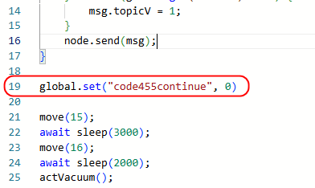

В конце же кода, после завершения движения, установите ее = 1 (ВНУТРИ IF):

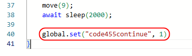

Теперь пишем код функции для 2го робота. Начало кода функции "код 455 (робот2)" такое же, как и у первой (копируем таймер, функции move и actVacuum), только поменяйте названия глобальных переменных curV2, curx2:

```javascript
const sleep = (waitTimeInMs) => new Promise(resolve => setTimeout(resolve, waitTimeInMs));

function move(tochka) {
    msg.topicX = tochka;
    msg.topicV = global.get("curV2");
    node.send(msg);
}

function actVacuum(){
    msg.topicX = global.get("curX2");
    if (global.get("curV2") == 1) {
        msg.topicV = 0;
    } else if(global.get("curV2") == 0) {
        msg.topicV = 1;
    }
    node.send(msg);
}

```

Далее, движение второго робота начинается, если значение code455continue стало равно 1 (пришел сигнал от 1го робота, что он закончил):

```javascript
const sleep = (waitTimeInMs) => new Promise(resolve => setTimeout(resolve, waitTimeInMs));

function move(tochka) {
    msg.topicX = tochka;
    msg.topicV = global.get("curV2");
    node.send(msg);
}

function actVacuum(){
    msg.topicX = global.get("curX2");
    if (global.get("curV2") == 1) {
        msg.topicV = 0;
    } else if(global.get("curV2") == 0) {
        msg.topicV = 1;
    }
    node.send(msg);
}

if (global.get("code455continue") == 1){ // если первый робот закончил
    ...алгоритм движения...
}

```

Алгоритм движения 2го робота пишется по такому же принципу, как для 1го.

В конце алгоритма после всех функций движения (но внутри if) сбрасываем значение code455continue:

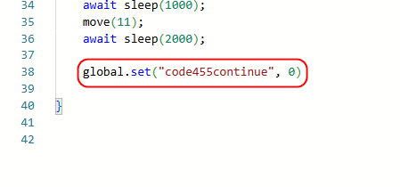

ВЫход функции "код 455 (робот2)" присоедините к розовой функции робота 2:

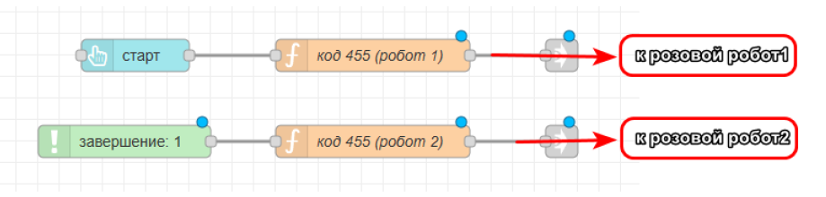

На этом сборка кода 455 готова

Аналогично делаются все остальные коды сборки
