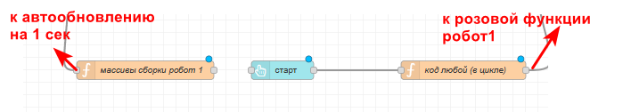

# 5. Автоматическая сборка (продвинутая)

В стандартном способе мы вручную пишем код для каждой сборки, и, хотя это просто копировать-вставить, это занимает время.

Здесь расскажу про способ авто сборки с одной функцией, но он предполает использование массивов и циклов. Если не уверены в своих силах - используйте "простой" способ (лучше сделать проще, но чтобы работало, чем не сделать вообще, потому что забыл сложный способ)

1. Убедитесь, что у вас есть функция записи кода сборки в глобал
2. Общий вид кода:



3. Начнем с функции "массивы сборки робот 1". Эта функция нужна, чтобы в глобальные переменные записать массивы точек, соответствующие каждой сборке. Это должна быть последовательность **всех верхних точек**, в которые робот должен приехать, чтобы собрать готовую сборку. Итак, код функции:

```javascript
var sborki = {
    'c123': [19,7,21,11,23,15,1,15],
    'c115':[19,9,21,13,25,15,27,17,1,13],
    'c298':[...],
    'c457':[...],
    'c600':[...]
}

global.set('sborki', sborki)

return msg;
```

sborki - это объект, в котором находятся пары "код сборки": "массив точек"

в качестве ключей (c123, c115 и т.д.) - номера кодов сборок (с английской буквой "c" в начале, чтобы ключ начинался не с цифры и не было ошибок)

все это записывается в глобальную переменную sborki, чтобы мы могли получить доступ к этим значениям из другой функции

4. Следующая функция - функция собственно выполнения сборки (на моем скриншоте она называется "код любой (в цикле)")

В этой функции в начале добавляем стандартные уже функции move, actGripper и инициализацию таймера:

```javascript
const sleep = (waitTimeInMs) => new Promise(resolve => setTimeout(resolve, waitTimeInMs));

function move(tochka) {
    msg.topicX = tochka;
    msg.topicV = global.get("curV1");
    node.send(msg);
}

function actVacuum() {
    msg.topicX = global.get("curX1");
    if (global.get("curV1") == 1) {
        msg.topicV = 0;
    } else if (global.get("curV1") == 0) {
        msg.topicV = 1;
    }
    node.send(msg);
}
```

Далее нам нужно получить все сборки из глобальной переменной:

```javascript
var sborki = global.get('sborki')
```

Также подготовим пустую переменную, в которую будем записывать **массив с точками** именно **для выбранного (selected) кода сборки**:

```javascript
var selected = 0
```

Далее нужно написать код, который будет выбирать нужный массив с точками, в зависимости от пришедшего кода (номера) сборки (он хранится в глобальной переменной code). Проще всего воспользоваться оператором switch:

```javascript
switch(global.get('code')){
    case '123': 
        selected = sborki.c123
        break;
    case '115':
        selected = sborki.c115
        break;
    case '298':
        selected = sborki.c298
        break;
    case '457':
        selected = sborki.c457
        break;
    case '600':
        selected = sborki.c600
        break;
}
```

и теперь для массива, который записался в переменную selected, выполняем цикл:

```javascript
for (let i = 0; i<=selected.length; ++i){
    move(selected[i])
    await sleep(3000)

    move(selected[i]+1)
    await sleep(3000)

    actVacuum()
    await sleep(3000)

    move(selected[i])
    await sleep(3000)
}
```

итого, общий код функции:

```javascript
const sleep = (waitTimeInMs) => new Promise(resolve => setTimeout(resolve, waitTimeInMs));

function move(tochka) {
    msg.topicX = tochka;
    msg.topicV = global.get("curV1");
    node.send(msg);
}

function actVacuum() {
    msg.topicX = global.get("curX1");
    if (global.get("curV1") == 1) {
        msg.topicV = 0;
    } else if (global.get("curV1") == 0) {
        msg.topicV = 1;
    }
    node.send(msg);
}

var sborki = global.get('sborki')
var selected = 0;

switch(global.get('code')){
    case '123': 
        selected = sborki.c123
        break;
    case '115':
        selected = sborki.c115
        break;
    case '298':
        selected = sborki.c298
        break;
    case '457':
        selected = sborki.c457
        break;
    case '600':
        selected = sborki.c600
        break;

}

for (let i = 0; i<=selected.length; ++i){
    move(selected[i])
    await sleep(3000)

    move(selected[i]+1)
    await sleep(3000)

    actVacuum()
    await sleep(3000)

    move(selected[i])
    await sleep(3000)
}

move(1) //здесь нужно подвинуть робота в паркинг или промежуточную точку
await sleep(3000)

```

