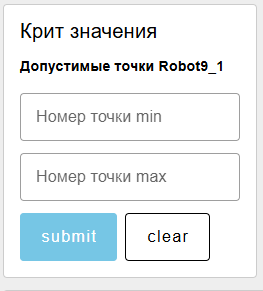
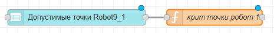
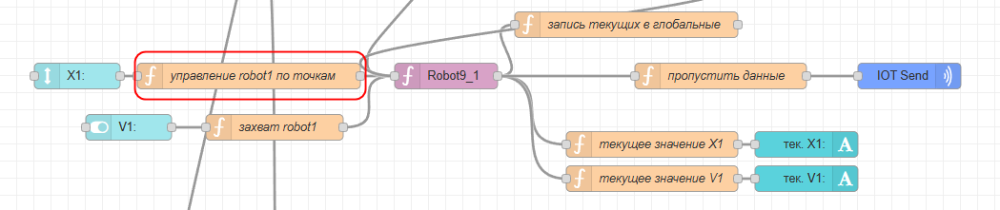
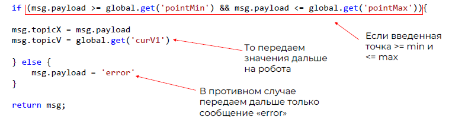
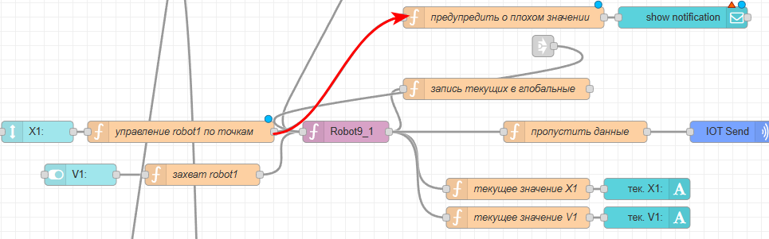
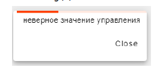

# 6. Неверные значения

А что будет, если оператор введет значение лампы = 999? Или значение X = -1875684?

Ничего хорошего. Но мы можем сделать так, чтобы неверные значения управления не уходили на оборудование.

> По факту на дашборде оператора у нас единственными значениями, которые нужно контролировать, являются значения номеров точек X перовго и второго робота

Для этого алгоритм такой же, как для критических значений на мэшапе технолога:

- В глобальные переменные записываются минимальные и максимальные значения X,V и др. которые может ввести пользователь
- Далее то, что ввел пользователь, сравнивается с макс/мин. Если значение неверное, то вылезает предупреждение

Создадим форму «настройка допустимых точек». В этой форме пользователь вводит максимальное и минимальное значение номеров точек





А в функции значения из формы сохраним в глобальные переменные. Код функции:

```javascript
global.set('pointMin1', msg.payload.pointMin1)
global.set('pointMax1', msg.payload.pointMax1)
return msg;
```

Теперь в функции «управление робот1\_1 по точкам» добавим проверку:



Код:



Для того, чтобы в случае неверной координаты у пользователя вылезало предупреждение, добавим функцию и ноду “notification”




В коде функции напишем: если пришло сообщение “error”, то передать команду дальше (на вывод уведомления). Код функции "предупредить о плохом значении":

```javascript
if (msg.payload == 'error') {
    var msg = { payload: "неверное значение управления" }
    return msg;
}

```

Теперь у пользователя будет вылезать предупреждение:



То же самое с отдельной формой нужно сделать для 2го робота. Если не успеваете, можно ограничиться одной формой на 2ух роботов (но в функции 2го робота нужно все равно добавить проверку и отдельно ноду notification)

Кроме роботов (для ламп, например), это делать не нужно, если вы используете переключатели (там и так может быть только вкл/выкл)
