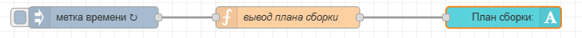
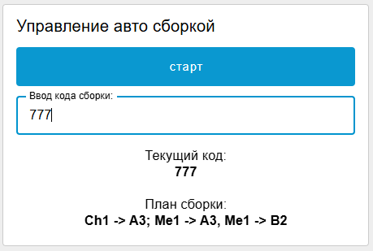
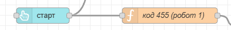
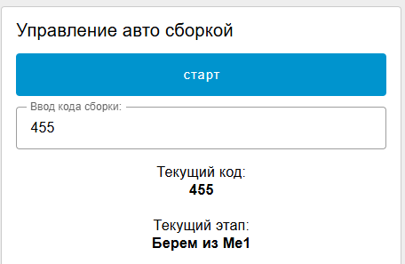
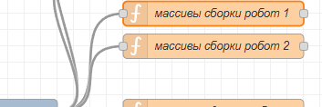
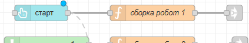
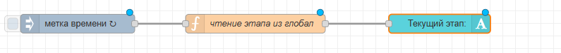

# 7. Текущая операция и план сборки

## План сборки

Каждый код сборки соотвествует какой-то сборке. Каждая сборка собирается из нескольких деталей. Любую сборку вы можете представить в виде плана или инструкции или "рецепта", например: `"Взять Ме1 и положить в А1; Взять Ме2 и положить в A2..."`; или в более коротком виде, например `"Me1->A1; Me2->A2..."`.

Нужно реализовать следующее: при выборе кода сборки рядом высвечивается план сборки примерно в таком виде, как выше.

Выбранный код сборки у нас хранится в глобальной переменной code. Давайте просто добавим функцию, которая будет выводить план в текстовое поле в зависимости от кода сборки.



Метка времени - автообновление 1 сек

Код функции "выбор плана сборки":

```javascript
var code = global.get("code") // считываем текущий код
var plan = 0 // создаем пустую переменную для плана

switch (code){ // в зависимости от кода сборки записываем в plan разный текст
    case "104":
        plan = "Ch1 -> B1; Ch2 -> A3, Me1 -> B2; С -> B1, Т > A3";
        break;
    case "217":
        plan = "Ch1 -> A3; Me1 -> A3, Me1 -> B2" // каждому коду свой план
        break
    case "800":
        plan = "Ch1 -> A3; Me1 -> A3, Me1 -> B2"
        break
    case "567":
        plan = "Ch1 -> A3; Me1 -> A3, Me1 -> B2"
        break
    case "777":
        plan = "Ch1 -> A3; Me1 -> A3, Me1 -> B2"
        break
    default:
        plan = "нет плана"
        break

}
msg.payload = plan // выводим план на дашборд
return msg;
```

Результат на дашборде:



## Текущая операция

Нужно выводить на экран, какое сейчас действие делает робот (ранее выводился план - то есть полный "рецепт" сборки, а тут нужно выводить каждый шаг отдельно, например "Me1->A1" или еще конкретнее, например, "Me1 вниз", "Me1 вверх", "Работа захвата" (на ваше усмотрение). Сделать это можно, создав глобальную переменную и меняя ее значение на каждом этапе сборки (в коде сборки). Проще всего -вручную.

### 1) Для простой авто сборки

Заходим в функцию сборки кода:



Пусть наша глобальная переменная называется `etap`. Теперь добавляем в нужные места в алгоритме сборки нужные названия этапа:

```javascript
// выше код без изменений

if (global.get("code") == '455') { 
    // алгоритм движения робота
    move(15);
    global.set('etap', 'Ме1 вверх') // шаг1
    await sleep(3000);
    move(16);
    global.set('etap', 'Ме1 вниз') // шаг2
    await sleep(2000);
    actVacuum();
    global.set('etap', 'Работа захвата') // шаг3
    await sleep(1000);
    move(15);
    global.set('etap', 'Ме1 вверх') // шаг4
    await sleep(2000);

// и так далее

    move(9);
    await sleep(3000);
    move(10)
    await sleep(2000);
    actVacuum();
    await sleep(1000);
    move(9);
    await sleep(2000);
}
```

Или, чтобы было быстрее **(лучше используйте этот вариант)**:

```javascript
if (global.get("code") == '455') { // движение начнется только если поступил нужный код
    // алгоритм движения робота
    
    global.set('etap', 'Берем из Ме1')
    move(15);
    await sleep(3000);
    move(16);
    await sleep(2000);
    actVacuum();
    await sleep(1000);
    move(15);
    await sleep(2000);

    global.set('etap', 'Ставим в А1')
    move(9);
    await sleep(3000);
    move(10)
    await sleep(2000);
    actVacuum();
    await sleep(1000);
    move(9);
    await sleep(2000);

    // и так далее
}
```

В конце сборки обязательно добавьте:

```javascript
 global.set('etap', 'Робот 1 закончил')
```

Потом то же самое сделайте для второго робота, переменная etap общая, так как роботы работают строго по очереди. В конце сборки второго робота добавьте

```javascript
 global.set('etap', 'Сборка завершена')
```

Далее эту переменную нужно вывести рядом с управлением авто сборкой


Метка времени - автообновление 1 сек, код функции:

```javascript
msg.payload = global.get("etap")
return msg;
```

Нужно так же добавить, что при инициализации переменная etap должна становиться равна null или 'ожидание' (добавьте это в инициализацию любого робота)

Результат:



### 2) Для продвинутой авто сборки

Заходим в функцию массивов сборки робота 1.



У нас есть массив точек, по которым едет робот для выполнения сборки. тут же запишем в глобальную переменную этапы сборки так же в виде массива. Можно написать для каждой точки свой этап ('берем из Ме1', 'ставим в А1' или одинаковый для нескольких (Me1->A1), но количество этапов должно быть такое же, как количество точек сборки, даже если у нескольких точек этапы будут одинаковые

Пусть наша глобальная переменная с хранилищем этапов первого робота называется `etapi1`.

```javascript
var sborki = {
    'c123': [19, 7, 21, 11, 23, 15, 1, 15],
    'c115': [19, 9, 21, 13, 25, 15, 27, 17, 1, 13],
    //'c298': [...],
    //'c457': [...],
    //'c600': [...]
}

// массив этапов
var etapi = {
    'c123': ['Берем Ме1', 'Ставим в А1', 'Берем Ме2', 'Ставим в А2', 'Берем Ме3', 'Ставим в А3','Берем Ч1', 'Ставим в Б1'],
    //'c115': [...],
    //'c298': [...],
    //'c457': [...],
    //'c600': [...]
}

global.set('sborki1', sborki)

global.set('etapi1', etapi) // сорхраняем в глобал

return msg;
```

Для второго робота аналогично, сохраняем в глобальную etapi2.

Далее идем в код сборки первого робота



Теперь добавляем в нужные места в алгоритме сборки названия этапа:

Сначала считываем этапы 1го робота из глобала, затем вставляем сохранение название этапа в общую глобальную переменную etap (она будет одна для обоих роботов).

<pre class="language-javascript"><code class="lang-javascript">// предыдущий код без изменений

var sborki = global.get('sborki1')

var etapi = global.get('etapi1') // считываем массив этапов 1го робота

var selected = 0;
var etap = 0; // переменная для текущего этапа

<strong>switch (global.get('code')) {
</strong>    case '123':
        selected = sborki.c123
        etap = etapi.c123 // выбираем массив этапов в зависимости от кода
        break;
    case '115':
        selected = sborki.c115
        etap = etapi.c115 // выбираем массив этапов в зависимости от кода
        break;
    case '298':
        selected = sborki.c298
        etap = etapi.c298 // выбираем массив этапов в зависимости от кода
        break;
    case '457':
        selected = sborki.c457
        etap = etapi.c457 // выбираем массив этапов в зависимости от кода
        break;
    case '600':
        selected = sborki.c600
        etap = etapi.c600 // выбираем массив этапов в зависимости от кода
        break;

}

global.set('robot2continue',0)

for (let i = 0; i &#x3C;= selected.length; ++i) {
    global.set('lampStatus1', 'moving')
    move(selected[i])
    global.set('etap', etap[i]) // выводим этап который соотвествует этой (i-той) точке
    await sleep(3000)

    move(selected[i] + 1)
    await sleep(3000)

    actVacuum()
    await sleep(3000)

    move(selected[i])
    await sleep(3000)
}

move(2001) //здесь нужно подвинуть робота в паркинг или промежуточную точку
await sleep(3000)
global.set('lampStatus1', 'parking')
global.set('robot2continue', 1)

</code></pre>

В конце всего кода можно добавить  `global.set('etap', 'Робот 1 закончил')`

Повторяем аналогично для 2го робота

Далее эту переменную нужно вывести рядом с управлением авто сборкой



Метка времени - автообновление 1 сек, код функции:

```javascript
msg.payload = global.get("etap")
return msg;
```

Нужно так же добавить, что при инициализации переменная etap должна становиться равна null или 'ожидание' (добавьте это в инициализацию любого робота)
