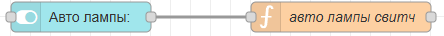
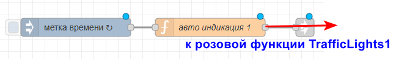
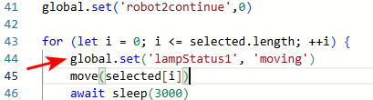
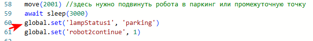

# 8. Автоматическая индикация

> _Кодировка сигналов:_
>
> _Постоянное свечение:_ красный (аварийная ситуация), синий (выполнение команды), зелёный (ожидание команды), желтый (парковка, безопасное положение для обслуживания).
>
> _Мигающая индикация:_ мигающий зеленый (закончена сборка изделия), мигающий желтый (режим паузы сборки или режим глобальной паузы), мигающий красный (ошибка в режиме паузы, не приведшая к сбросу процесса сборки, например, нарушение границ рабочей зоны или перегрев сервомотора).
>
> l1 = красный
>
> l2 = оранжевый
>
> l3 = зеленый
>
> l4 = синий

В этой статье рассмотрим только постоянное свечение.

Суть световой индикации - обмен данными между устройствами. В зависимости от состояния роботов, лампы горят разными цветами.

## Переключатель авто режима ламп

В первую очередь нужно добавить переключатель, который выбирает ручной или автоматический режим ламп сейчас выбран. Сделаем так - если переключатель отключен, то ручной режим. Если включен - автоматический. Добавляем переключатель в группу "панель управления":



Код функции:

```javascript
global.set("autoLamps", msg.payload)
return msg;
```

## Выбор цвета лампы

Далее добавим функцию "авто индикация 1" для первой лампы. **Метка времени настроена на автообновление каждую 1 сек.** Вид:



Внутри функции распишем следующим образом. Пусть у нас есть переменная "lampStatus1". Эта переменная может принимать следующие значения:

- "avaria" - если случилась авария
- "moving" - если робот двигается
- "waiting" - если робот ожидает
- "parking" - если робот стоит на парковке

Каждому из этих статусов сответствует разный цвет ламп свтофора: avaria = красный ( L1), "moving" = синий (L4), "waiting" = зеленый (L3), "parking" = желтый (L2). То есть, в каждом случяе нам нужно отправить свои команды на робота (нужный цвет = 1, остальные цвета = 0). Код (можно сделать через if вместо switch):

```javascript
switch (global.get('lampStatus1')){
        case "avaria":
            msg.topicL1 = 1;
            msg.topicL2 = 0;
            msg.topicL3 = 0;
            msg.topicL4 = 0;
            break;
        case "moving":
            msg.topicL1 = 0;
            msg.topicL2 = 0;
            msg.topicL3 = 0;
            msg.topicL4 = 1;
            break;
        case "waiting":
            msg.topicL1 = 0;
            msg.topicL2 = 0;
            msg.topicL3 = 1;
            msg.topicL4 = 0;
            break;
        case "parking":
            msg.topicL1 = 0;
            msg.topicL2 = 1;
            msg.topicL3 = 0;
            msg.topicL4 = 0;
            break;
        default: // если никакого статуса нет, то пусть горит зеленый
            msg.topicL1 = 0;
            msg.topicL2 = 0;
            msg.topicL3 = 1;
            msg.topicL4 = 0;
            break;
    }
    return msg;
```

Но, авто управление лампами должно работать только если включен переключатель autoLamps. Поэтому добавляем if вокруг всего кода:

```javascript
if (global.get('autoLamps')){

    switch (global.get('lampStatus1')){
        case "avaria":
            msg.topicL1 = 1;
            msg.topicL2 = 0;
            msg.topicL3 = 0;
            msg.topicL4 = 0;
            break;
        case "moving":
            msg.topicL1 = 0;
            msg.topicL2 = 0;
            msg.topicL3 = 0;
            msg.topicL4 = 1;
            break;
        case "waiting":
            msg.topicL1 = 0;
            msg.topicL2 = 0;
            msg.topicL3 = 1;
            msg.topicL4 = 0;
            break;
        case "parking":
            msg.topicL1 = 0;
            msg.topicL2 = 1;
            msg.topicL3 = 0;
            msg.topicL4 = 0;
            break;
        default:
            msg.topicL1 = 0;
            msg.topicL2 = 0;
            msg.topicL3 = 1;
            msg.topicL4 = 0;
            break;
    }
    return msg;
}
```

в конце добавим на всякий случай замену - если autoLamps выключен, то поместить в переменную статуса лампы lampStatus1 значение "manual" (переводится как "ручной режим"):

```javascript
if (global.get('autoLamps')){

    switch (global.get('lampStatus1')){
        case "avaria":
            msg.topicL1 = 1;
            msg.topicL2 = 0;
            msg.topicL3 = 0;
            msg.topicL4 = 0;
            break;
        case "moving":
            msg.topicL1 = 0;
            msg.topicL2 = 0;
            msg.topicL3 = 0;
            msg.topicL4 = 1;
            break;
        case "waiting":
            msg.topicL1 = 0;
            msg.topicL2 = 0;
            msg.topicL3 = 1;
            msg.topicL4 = 0;
            break;
        case "parking":
            msg.topicL1 = 0;
            msg.topicL2 = 1;
            msg.topicL3 = 0;
            msg.topicL4 = 0;
            break;
        default:
            msg.topicL1 = 0;
            msg.topicL2 = 0;
            msg.topicL3 = 1;
            msg.topicL4 = 0;
            break;
    }
    return msg;
} else {
    global.set('lampStatus1', 'MANUAL')
}
```

Аналогично можно сделать такую функцию для второй лампы, повесить ее на то же автообновление и присоединить ее к розовой функции для **второй лампы**.

### Переключение статусов для авто режима

Теперь у нас есть функция, которая зажигает нужную лампу в зависимости от статуса, но откуда берется статус, где он меняется?. Во-первых, мы точно знаем, что при автоматическом движении робота робот двигается, значит это статус moving (синяя лампа), а в конце сборки робот едет на парковку, это статус parking (желтая лампа). Добавим это прямо в код авто-сборки (неважно, сделана ли она у вас по простому варианту или по сложному):

Добавляем статус moving в начало выполнения сборки (место, с которого робот начинает дивгаться, то есть перед первый появлением функции move):



В конце кода сборки добавляем статус parking:



Итак, уже два статуса у нас появились. Это минимальный набор. Нужно так же добавить moving и waiting статусы в функции ручного управдения, сделайте это самостоятельно и не забудьте про второго робота!
