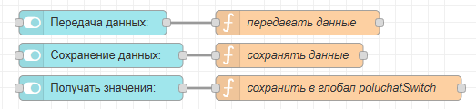
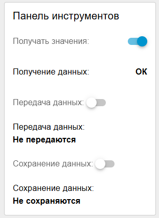

# 1. Панель инструментов (сохранение, получение и передача данных)

На панели инструментов нужно разместить три переключателя: "получать данные", "передавать данные"  и "сохранять данные". **Глобальные переменные для этих переключателей такие же**, как на дашборде технолога (получать  данные) дашборде оператора (передавать данные) и на обоих предыдущих дашбордах (сохранять данные):



Код "получать данные"

```javascript
global.set("poluchatSwitch", msg.payload)
return msg;
```

Код "передавать данные"

```javascript
global.set("controlSwitch", msg.payload)
return msg;
```

Код "сохранять данные":

```javascript
global.set("saveSwitch", msg.payload)
return msg;
```

Так же нужно сделать индикаторы этих переключателей , аналогично тому, как это сделано в [10.-dopolnitelnye-elementy.md](../modul-b.-inzhener-tekhnolog/10.-dopolnitelnye-elementy.md "mention") (так как у вас есть уже эти индикаторы на других дашбордах, просто скопируйте их)



Переключатель получения данных нужен, так как на дашборде менеджера будут выводиться графики по текущим данным и данные статистики, которые так же считаются по текущим приходящим от роботов данным

Переключатель передачи данных нужен, так как с дашборда менеджера делается автоматическое управление роботами

**Сюда так же нужно самостоятельно перенести переключатель авто режима ламп, если вы его делали на операторе**

Переключатель сохранения данных нужен, так как на менеджере должны записываться значения в базы данных
