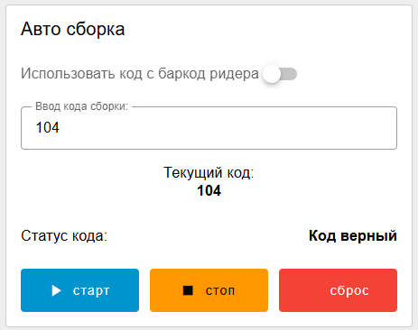

# 2. Управление авто режимом

Нужно скопировать группу "управление авто режимом" с дашборда оператора на дашборд менеджера (при копировании не потеряйте соединение функций сборок с розовыми функциями роботов!). По сути вам нужно скопировать все, что касается авто сборки из одной вкладки нод ред (оператор) в новую вкладку нод ред (менеджер) и продублировать виджеты в новой группе на дашборде менеджера.

Также добавьте 2 кнопки (ничего не делающие) рядом с кнопкой "старт" - кнопки "стоп" и "сброс". Итоговый вид (часть элементов, касающаяся кода сборки, рассмотрена далее в статье [5.-dannye-barkod-ridera-i-sistemy-bezopasnosti.md](5.-dannye-barkod-ridera-i-sistemy-bezopasnosti.md "mention")

