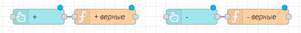
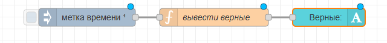
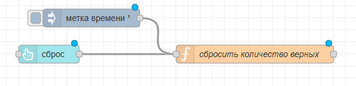
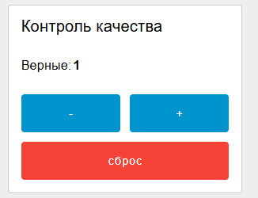

# 3. Контроль качества

Нужно добавить "калькулятор" количества верных изделий на дашборд

В теории это количество должно вычисляться автоматически, но если данных не хватает –можно сделать «ручной режим», чем мы и займемся.

Добавляем две кнопки: одна прибавляет +1 к количеству верных изделий, вторая отнимает -1 от верных изделий:



Код функции "+ верные" (к глобальной переменной verno прибавляем 1):

```javascript
var kolvo = global.get("verno") + 1
global.set("verno", kolvo)
return msg;
```

Код функции "- верные" (из глобальной переменной verno отнимаем 1):

```javascript
var kolvo = global.get("verno") - 1
global.set("verno", kolvo)
return msg;
```

Далее количество верных изделий выводим на дашборд (настройки метки времени: автообновление 1 сек):



Код функции:

```javascript
var  msg = { payload: global.get("verno") }
return msg;
```

Но! Кнопки не будут работать, если не задано начальное значение (сколько изначально верных сборок?). Надо добавить функцию инициализации и повесить ее на автозапуск (1 раз при запуске страницы) и/или на кнопку «сброс»:



```javascript
global.set("verno", 0)
return msg;
```

Настройки метки времени: отправить 1 раз, затем не отправлять

Результат на дашборде:



