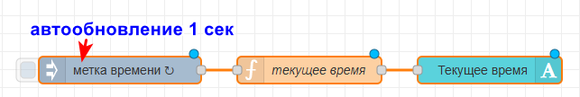
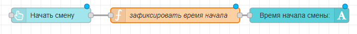
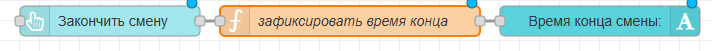
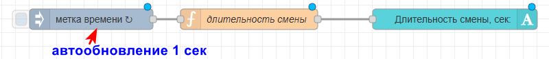
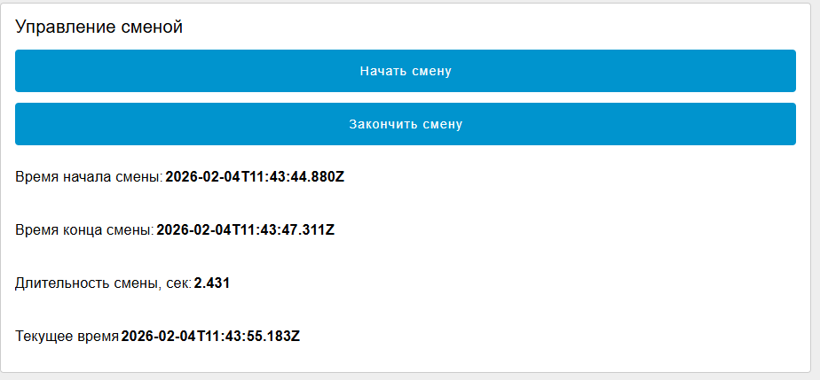
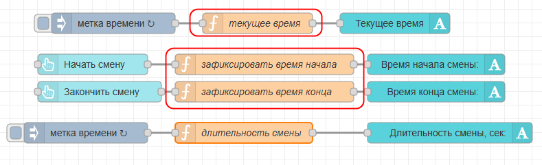
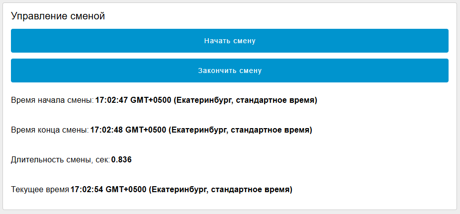

# 4. Управление рабочими сменами

По заданию нужно добавить на дашборд кнопки управления рабочей сменой.

- Смена началась - нажали "старт смены", записалось время начала.
- смена закончилась - нажали "стоп смены", записалось время конца и вычислилась длительность смены.

Сначала добавим отображение текущего времени:



Код функции "текущее время":

```javascript
var currentTime= new Date();
var msg = {payload: currentTime}
return msg;
```

Команда new Date() возвращает текущее время и дату. Мы просто выводим их на экран и обновляем раз в секунду.

Далее добавляем кнопку "начать смену". Вид цепочки:



Код функции "зафиксировать время начала":

```javascript
var currentTime = new Date();
global.set("smenaStart", currentTime)
global.set("smenaStop", 0)

var msg = {payload: currentTime}

return msg;
```

При нажатии на кнопку "начать смену" отметка времени записывается в currentTme а затем в глобальную переменную smenaStart и выводится на дашборд. Также обнуляется значение smenaStop (внутри smenaStop должна храниться отметка о конце смены. так как мы только начали новую смену, конца смены еще не было)

Далее добавляем кнопку конца смены. Вид цепочи блоков:



Код функции "зафиксировать время конца":

```javascript
var currentTime= new Date();
global.set("smenaStop", currentTime)
var msg = {payload: currentTime}

return msg;
```

Наконец, нужно вывести на экран время в секундах.



Код функции "длительность смены":

```javascript
var smenaStart= global.get("smenaStart")
var startTime= smenaStart.getTime()

//тут типа рабочие поработали
var smenaStop= global.get("smenaStop")
var stopTime= smenaStop.getTime()

var difference = (stopTime-startTime)/1000;

var msg = { payload: difference }
return msg;
```

Получаем значения глобальных переменных с временем начала и конца смены. Команды `smenaStart.getTime()` и `smenaStop.getTime()` берут из этих значений только время (потому что по умолчанию там и время и дата и т.п.)

Далее просто считаем разницу `difference = (stopTime-startTime)/1000`, это и есть длительность смены (в секундах).

При выводе на экран не забудьте подписать, что длительность в секундах!

Вид на дашборде:



Сейчас дата и время выводятся в виде

`ГГГГ-ММ-ДДТЧЧ:ММ:СС + часовой пояс.`

Читать такое не удобно. Сделать вывод более приличным можно, изменив в функциях "текущее время", "зафиксировать время начала" и "зафиксировать время конца"



Заменить

```javascript
currentTime
```

на

```javascript
currentTime.toTimeString() 
```

в выводе в msg (и только там), например:

```javascript
var currentTime= new Date();
var msg = { payload: currentTime.toTimeString() }
return msg;
```

```javascript
var currentTime = new Date();
global.set("smenaStart", currentTime) // тут не меняем!
global.set("smenaStop", 0)
var msg = { payload: currentTime.toTimeString() } //тут меняем

return msg;
```

и

```javascript
var currentTime= new Date();
global.set("smenaStop", currentTime)
var msg = { payload: currentTime.toTimeString() }

return msg;
```

Тогда на дашборде будет выглядеть так:



В идельном варианте по заданию нужно сделать запись данных о нескольких сменах. Формулировка такая, что это можт быть, например, 3 смены. для этого просто скопируйте все, что сделано выше несколько раз (2), и назовите смена 1,  смена 2, и смена 3
