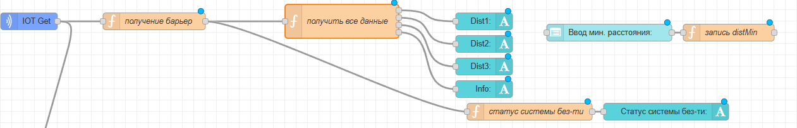
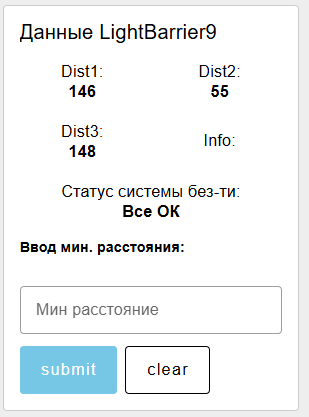
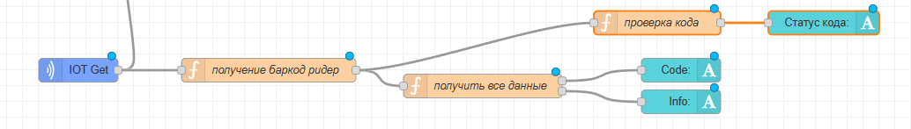
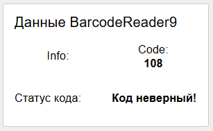
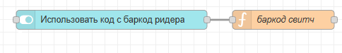
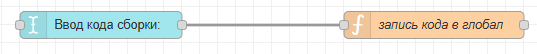
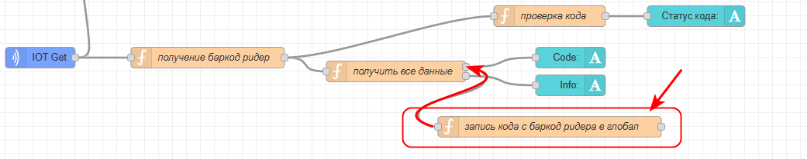
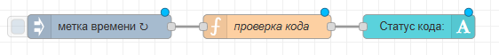

# 5. Данные баркод ридера и системы безопасности

Нужно продублировать на дашборд менеджера группы с дашборда технолога с баркод ридером и системой безопасности

## Данные системы безопасности

Просто переносим как есть с технолога на менеджера (копируем, меняем дашборд и группу в свойствах виджетов).



Результат:



## Данные баркод ридера

Во-первых, так же как с лайт барьером, нужно скопировать группу баркод ридера с дашборда технолога или оператора



Результат:



Но это еще не все. Нам нужно организовать использование кода с баркод ридера как кода для сборки. Должен быть выбор - либо код введенный вручную, либо код с баркод ридера. Код из выбранного источника записывается в глобальную переменную, например, code, далее проверяется верный/неверный/разделитель. Далее именно по этому коду выполняется сборка.

Сначала добавим переключатель "Использовать код с баркод ридера" (разместите его в группу панели управления или в группу авто сборки)



Код функции:

```javascript
global.set("autoCodeSwitch", msg.payload)
return msg;
```

Далее. В группе управления авто режимом на дашборде менеджера у вас есть поле для ручного ввода кода:



Модифицируйте код функции. Записывать код в code только если переключатель "использовать код с баркод ридера" выключен (autoCodeSwitch == false или !autoCodeSwitch):

```javascript
if (!global.get("autoCodeSwitch")){
    global.set("code", msg.payload) // эта строчка была
}
```

Далее идем в группу чтения данных с баркод-ридера. Добавляем функцию "запись кода с баркод ридера в глобал" и соединяем ее с выходом, куда отправляется само значение кода (c):



Записываем данные с баркод ридера в глобальную переменную code только если переключатель autoCodeSwitch включен:

```javascript
if(global.get("autoCodeSwitch")){
    global.set("code", msg.payload)
}
```

Готово. Нам не придется ничего менять в сборке по коду, перменная кода так и осталась code. только значение в нее будет записываться либо из поля для ручного ввода или из данных баркод ридера!

Так же нужно продублировать индикатор верный/неверный код, как у данных баркод ридера, но в группу автосборки и проверять значение глобальной переменной code:



Код функции (можно скопировать из данных баркод ридера и модифицировать)

```javascript
var code = global.get('code')

if ( code == "104" ||
    code == "217" ||
    code == "800" ||
    code == "567" ||
    code == "777") {
        msg.payload = "Код верный"
} else if (code == "0"){
        msg.payload = "Пустой код"
    } else {
        msg.payload = "Код неверный!"
    }
return msg;
```
