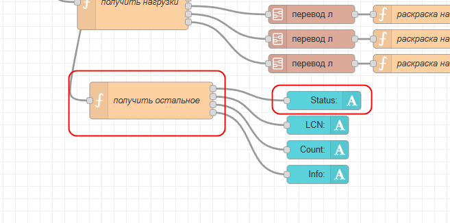
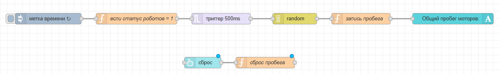
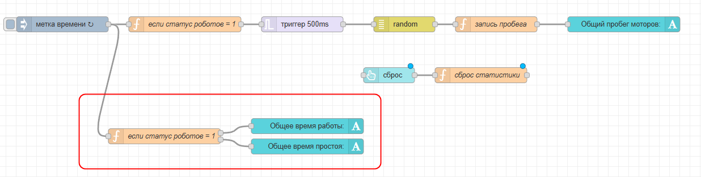
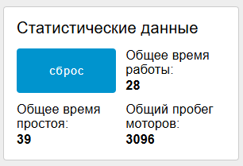
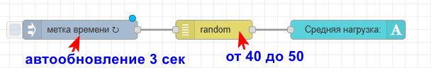
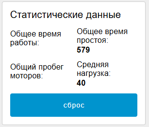

# 6. Статистика

На дашборде менеджера нужно выводить 4 значения статистических показателей:

- Общий пробег моторов
- Длительность работы роботов
- Время простоя
- Средняя нагрузка

(можно вывести по каждому роботу отдельно или просуммировать и вывести общее)

Для почти всех значений нам понадобятся статусы роботов. Это свойство s, которое мы выводим на дашборд технолога. S = 1, когда робот двигается, и s = 0 когда робот стоит. Давайте запишем эти значения в глобальные переменные прямо в потоке технолога.

Найдите функции, где считывается s первого робота:



Внутри кода этой функции добавьте строчку:

```javascript
var msg1 = { payload: msg.payload.s }; // это оно
var msg2 = { payload: msg.payload.n };
var msg3 = { payload: msg.payload.c };
var msg4 = { payload: msg.payload.i };

//нужное нам число - это msg.payload.s
// записываем его в глобал:

global.set('status1', msg.payload.s) // новая строчка

return [msg1, msg2, msg3, msg4]
```

Аналогично сделайте со вторым роботом.

Теперь в глобальной переменной status1 у нас хранится 0 или 1 число для первого робота, а в status2 - для второго робота

## Общий пробег моторов

Пробег моторов - это то "расстояние", на которое повернулись все моторы за время работы. В нашем случае расстояние измеряется в градусах (круга). В целом, можно заняться высчитыванием этого значения, но можно просто его изобразить. Каждый раз когда роботы работают (в этот момент статус робота = 1, будем прибавлять к какой-то глобальной переменной (например probeg) рандомное значение, примерно похожее на то, какой мог бы быть пробег у робота по всем моторам (пусть  это будет от 40 до 70 градусов). Учитывая, что за раз работает только один робот, это будет реалистичное значение.

Рандомное число будем получать из блока random.



Настройки такие: метка времени - автообновление 1 сек

функция "если статус роботов = 1":

```javascript
if (global.get('status1') == 1 || global.get('status2') == 1){
    return msg;
}

```

Блок триггера -  500 милисекунд, поставить галочку "проблить при поступлении нового сообщения"

Блок рандом: значения от 40 до 70

Функуция "запись пробега":

```javascript
var probeg = global.get('probeg') + msg.payload // берем текущее значение пробега и прибаляем к нему наше число
global.set('probeg', probeg) // записываем новое значение в global probeg

msg.payload = probeg
return msg;
```

Далее вывод значения на экран.

Также добавляем кнопку сброса (они пригодится и для других статистических данных). Функция кнопки сброса:

```javascript
global.set('probeg', 0)
return msg;
```

## Длительность работы роботов и время простоя

Так же будем отслеживать по статусу. Добавляем одну новую функцию (сразу сделайте у нее два выхода):



Код функции:

```javascript
var rabota = global.get('rabota') // считываем текущее значение длительности работы
var prostoy = global.get('prostoy') // считываем текущее значение длительности простоя

if (global.get('status1') == 1 || global.get('status2') == 1){ // если хотя бы один из роботов двигается
    // так как эта функции висит на автообновлении 1 сек, то +1 в строках ниже будет как раз +1 секунда
    rabota = rabota +1 // прибавляем +1 (сек) ко времени работы
} else {
    prostoy = prostoy + 1 // если ни один робот не двигается, прибавляем +1 сек ко времени простоя
}

global.set('rabota', rabota) // записываем новое значение в глобальную rabota
global.set('prostoy', prostoy) // записываем новое значение в глобальную prostoy

var msg1 = {payload: rabota} // выводим длительность работы на экран
var msg2 = { payload: prostoy } // выводим длительность простоя на экран

return [msg1, msg2] // массив, т.к. у функции два выхода
```

Вид:



## Средняя нагрузка

Понаблюдайте за значениями l (нагрузка), приходящими с роботов. Оцените примерно, какое среднее значение? Скорее всего, оно будет в пределах 40-50. Используем блок random и будем выводить раз в 3 секунды новое значение "средней нагрузки":




